# Orcanos AI — Infrastructure Handbook

**One document that explains the whole Orcanos AI setup.** Read it top to bottom and you
will know what we run, where it runs, how it is secured, how it is paid for, and what we
plan to do next.

| | |
|---|---|
| **Audience** | IT, developers, auditors, new team members |
| **Written** | 2026-09-09 · **last updated 2026-09-10** |
| **Latest change** | **Data residency (EU / US)** — a new [chapter 5](#5-data-residency--eu-and-us), and updates through chapters 3, 4, 7, 8, 10, 13, 14, 19, 20, 22. The full account is in [`CHANGES-2026-09-09-REGIONS.md`](CHANGES-2026-09-09-REGIONS.md) |
| **Owner** | Zohar Peretz |
| **Status** | Living document — update it when infrastructure changes |
| **Lives in** | `account-management/docs/platform/` (git repo `zoharp/account-management`) |
| **Built from** | The repos themselves (each project's own `CLAUDE.md` is the authority for its code), the internal Claude team deck and setup guide in `OneDrive/Documents/Claude/Projects/Claude Infrastructure`, and the AI-infrastructure onboarding session of 2026-09-09 |

> **How to read this.** Every chapter stands on its own. Chapters 1–5 are the map.
> Chapters 6–14 are how things work day to day. Chapters 15–20 are how we build and ship.
> Chapters 21–22 are the future. Words in **bold** the first time they appear are in the
> [Glossary](#23-glossary).

---

## Table of contents

1. [The big picture](#1-the-big-picture)
2. [The applications](#2-the-applications)
   · [2.6 Inside Ask Paul — the RAG architecture](#26-inside-ask-paul--the-rag-architecture)
3. [Environments — Fly, Vercel, Supabase, Cloud Run, IIS](#3-environments--fly-vercel-supabase-cloud-run-iis)
4. [Single-tenant vs multi-tenant](#4-single-tenant-vs-multi-tenant)
5. [**Data residency — EU and US**](#5-data-residency--eu-and-us) 🆕
   · [5.7 ⚠️ What is NOT residency yet](#57--what-is-not-residency-yet)
   · [5.8 ⚠️ The secret-parity trap](#58--the-secret-parity-trap)
6. [Working with Orcanos web services](#6-working-with-orcanos-web-services)
7. [Authentication](#7-authentication)
8. [Silent login to Ask Paul (cross-app SSO)](#8-silent-login-to-ask-paul-cross-app-sso)
9. [Caching — quick cache and slow cache](#9-caching--quick-cache-and-slow-cache)
10. [Databases, and converting SQLite to Postgres](#10-databases-and-converting-sqlite-to-postgres)
11. [Cost — how we record it and how we control it](#11-cost--how-we-record-it-and-how-we-control-it)
12. [Managing the LLMs](#12-managing-the-llms)
13. [Security — how we work](#13-security--how-we-work)
14. [ISO 27001 considerations](#14-iso-27001-considerations)
15. [How we work with Claude Code](#15-how-we-work-with-claude-code)
16. [Skills — what they are, where they live, how to use them](#16-skills--what-they-are-where-they-live-how-to-use-them)
17. [CLAUDE.md and MD files](#17-claudemd-and-md-files)
18. [GitHub and our CI/CD](#18-github-and-our-cicd)
19. [Installing Traceability on IIS](#19-installing-traceability-on-iis)
20. [User manual — Account Management (admin)](#20-user-manual--account-management-admin)
21. [Future: stay on Vercel/Fly, or move everything to Orcanos AWS?](#21-future-stay-on-vercelfly-or-move-everything-to-orcanos-aws)
22. [Next steps — the short list](#22-next-steps--the-short-list)
23. [Glossary](#23-glossary)
24. [What this document does *not* cover yet](#24-what-this-document-does-not-cover-yet)

---

## 1. The big picture

Orcanos AI is **not one system**. It is a small family of apps that share three things:
one login token, one encryption key, and one master database.

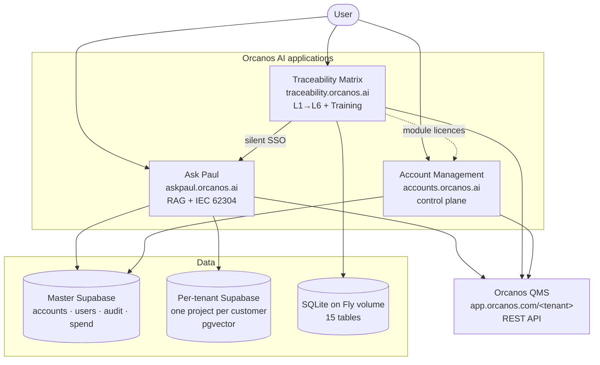

**The three shared things.** Break any one of them and live customers break with it.

| Shared | What it is | What happens if it differs between apps |
|---|---|---|
| `JWT_SECRET` | One HS256 session token. Claims: `sub`, `email`, `name`, `account`, `auth_method`, `iss: "orcanos-qms"`, 24 h expiry. | Sessions stop working across apps. This token is the **whole basis** of "one login". |
| `ENCRYPTION_KEY` | base64, 32 bytes. AES-256-GCM. Format `base64(12-byte nonce ‖ ciphertext ‖ 16-byte tag)`. | All stored customer secrets become **undecryptable**. Rotation tool: Ask Paul's `backend/rotate_encryption_key.py`, and it must run **before** the variable changes, for every app. |
| Master Supabase | Tables `accounts`, `users`, `auth_methods`, `account_usage_logs`, `security_audit_log`, `account_llm_keys`, `account_provisioning`. | Two apps disagree about who a customer is. |

---

## 2. The applications

### 2.1 Ask Paul — the QMS AI assistant

| | |
|---|---|
| **URL** | https://askpaul.orcanos.ai |
| **Repo / folder** | `zoharp/orcanos_qms_AI` · `c:\AI Projects\Orcanos QMS` |
| **Version** | backend `2.38.5`, frontend `1.39.0` |
| **What it does** | Multi-tenant **RAG** compliance assistant over ISO 27001 / 13485 / 14971, plus an IEC 62304 requirements pipeline |
| **Runtime** | FastAPI (Python 3.11) on **Google Cloud Run** + React/Vite on **Vercel** |
| **Data** | Master Supabase **+ one Supabase project per customer** (pgvector) **+** customer SQL Server, read-only |
| **Auth** | Platform JWT in `localStorage`. Google / Office 365 / Orcanos email |
| **Docs** | `CLAUDE.md`, then `MD files/SYSTEM.md`, `MD files/ARCHITECTURE.md`, `MD files/SCHEMA.md` |
| **Help site** | https://orcanos.gitbook.io/orcanos-qms-ai/ |

Ask Paul is the app with the most moving parts: a document ETL, a vector index, a
two-stage query router, streaming answers, and per-account LLM routing.

### 2.2 Traceability Matrix

| | |
|---|---|
| **URL** | https://traceability.orcanos.ai (also installable on customer **IIS**) |
| **Repo / folder** | `zoharp/traceability-matrix` · `c:\AI Projects\traceability-matrix` |
| **Version** | `3.42.1` |
| **What it does** | Requirement→test traceability, levels L1→L6, gap detection, funnels, graph view, HTML/Excel export, plus the **Training** module (training traceability panels + quizzes) |
| **Runtime** | FastAPI + React **in one container** on **Fly.io** — single machine, 1 GB volume, **Litestream** replication |
| **Data** | **SQLite** on the Fly volume, 15 tables |
| **Auth** | Proxies Orcanos `QW_Login`, then keeps its **own** server-side session row + httpOnly cookie + CSRF token |
| **Docs** | `CLAUDE.md` → `docs/notes/` (55 numbered traps), `docs/API.md`, `docs/FILE_MAP.md` |
| **Help site** | https://orcanos.gitbook.io/traceability-marix/ |

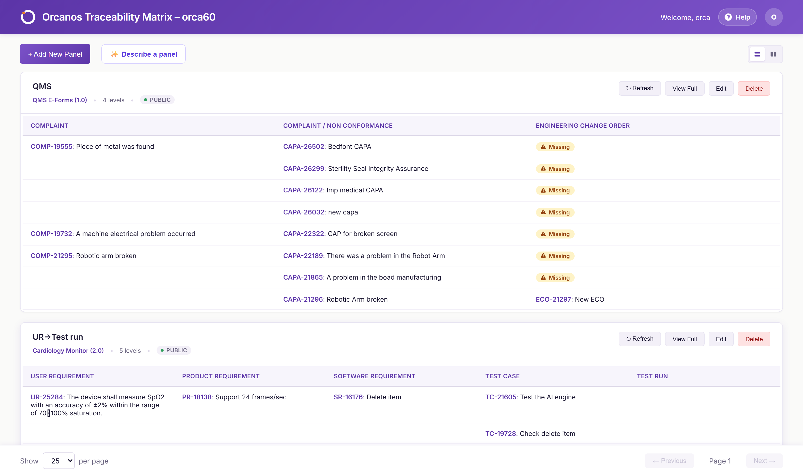
*The dashboard — every saved panel, with its own actions menu.*

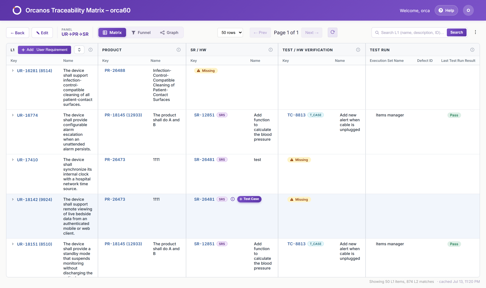
*A built matrix. L1 rows with their L2–L6 children indented underneath; gaps are marked.*

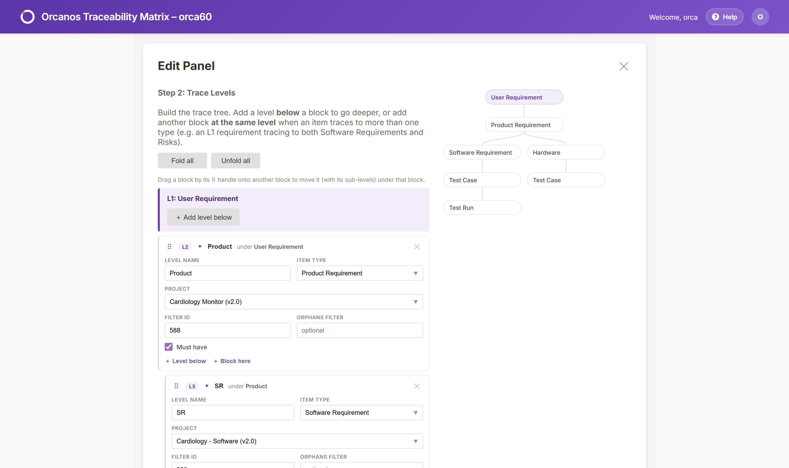
*The three-step wizard that creates a panel: base level, extra levels, then privacy.*

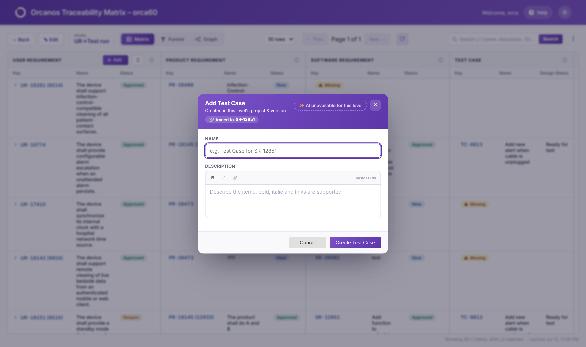
*"Describe a panel" — plain English in, a reviewed draft out. It is grounded, not generative:
it can only choose item types the tenant actually has.*

### 2.3 Account Management — the control plane

| | |
|---|---|
| **URL** | https://accounts.orcanos.ai |
| **Repo / folder** | `zoharp/account-management` · `c:\AI Projects\compliance-platform\account-management` |
| **Version** | `0.3.4` |
| **What it does** | Manages tenant **accounts** — their databases, credentials, module licences, status and spend — plus the shared security audit trail |
| **Runtime** | Next.js 15 + React 19 + TypeScript on **Vercel**, route handlers only (no separate backend) |
| **Data** | Master Supabase, via PostgREST |
| **Auth** | Platform JWT in an **httpOnly cookie**. Google / Office 365 / Orcanos |
| **Docs** | `CLAUDE.md`, `ARCHITECTURE.md`, `SCHEMA.md`, `SECURITY.md`, `DEPLOYMENT.md` |

It was extracted from the Accounts panel inside Ask Paul. **Both are still running**, on
the same data, so they can be compared before the old panel is retired.

### 2.4 The other two (context only)

| App | What | Runtime | Note |
|---|---|---|---|
| **covaris-bom** | Read-only BOM tree browser for one customer | Static React on Vercel, no backend, no database | Logs in to Orcanos **client-side**. Cheapest app to absorb into a portal, gains the least. |
| **quiz-management** | Training quizzes, assignment, pass/fail | Next.js on Vercel + Supabase queried **from the browser** | Uses Supabase Auth + RLS — a different security model. The plan is to absorb the *domain* and discard the *code*. |

### 2.5 The portal that does not exist yet

`zoharp/ai-portal` (`c:\AI Projects\ai-portal`) is an **empty repo with a plan**: one front
door, one login, a module launcher. Read `ai-portal/CLAUDE.md` before proposing any
consolidation work — it already records the decisions and the recommended order.

### 2.6 Inside Ask Paul — the RAG architecture

Ask Paul is the most complex app we run, so it gets its own walkthrough. Reference skill:
**`orcanos-rag-architecture`**. Code: `backend/etl.py`, `chunker.py`, `router.py`, `rag.py`.

There are **two halves**: getting documents *in* (indexing), and answering questions
*out* (query). They meet at one place — the `doc_chunks` table with its vectors.

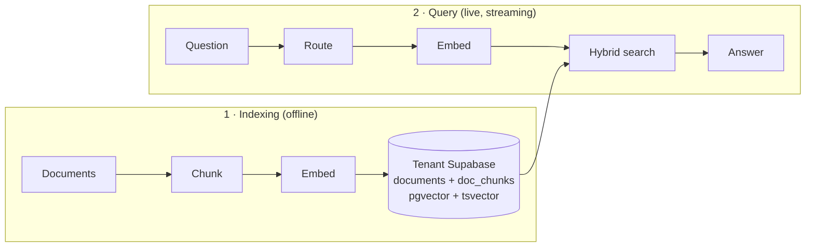

#### 2.6.1 Importing data — the ETL

Three ways documents get in. All three end in the same place.

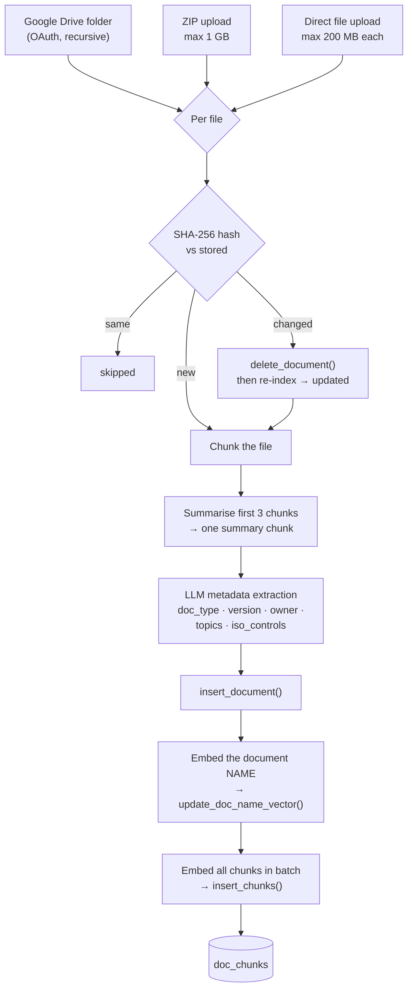

| Point | Detail |
|---|---|
| **File types** | `.pdf` (PyMuPDF), `.docx` (python-docx), `.txt`, `.md`, `.csv` |
| **Dedup** | SHA-256 of the content. Same hash → **skipped**. Changed → delete then re-index → **updated**. This is what makes re-running an import cheap and safe |
| **Deletions** | Google Drive indexing **removes documents no longer in the folder** — the folder is the source of truth |
| **Failure rule** | **Stops after 3 consecutive errors.** It does not grind through a thousand broken files |
| **Progress** | A generator streaming `start` / `progress` / `result` / `fatal` events, consumed by the React upload modal |
| **Metadata extracted** | `doc_type` (Form, Policy, Procedure, Work Instruction, Record, Checklist, Manual, Guideline), `doc_id`, `doc_title`, `version`, `owner`, `department`, `effective_date`, `description`, 2–5 `topics`, and `iso_controls` — the actual clause ids, e.g. `["7.3.2", "8.2.1"]` |

> **The document-name vector is easy to forget and it breaks routing.** Stage 2 of the
> router searches *document names*, not content. If `name_vector` is not populated, the
> router finds no candidate, picks a document that does not exist, and the user gets
> "0 chunks searched / information not available". **Fix: re-index.**

#### 2.6.2 Chunking

| Setting | Value |
|---|---|
| Chunk size | ~1000 characters (`chunk_size` in `rag_settings`) |
| Overlap | ~200 characters (`chunk_overlap`) |
| Boundaries | Paragraph/section first, falling back to sentences — never a blind character cut |
| Stored per chunk | `text`, `vector`, `doc_name`, `chunk_index`, `chunk_type` (`summary` \| `section`), `metadata` (e.g. `page_number`) |
| Special | **One AI summary chunk per document** (`chunk_type = summary`) — it is what lets a question about a whole document find anything at all |
| Source | Works from a file path **or** raw bytes, which is what makes Google Drive streaming possible |

#### 2.6.3 The router — two stages, and most queries never reach the LLM

Every question is classified first. Getting this right is what stops us running an
expensive search for "list all documents".

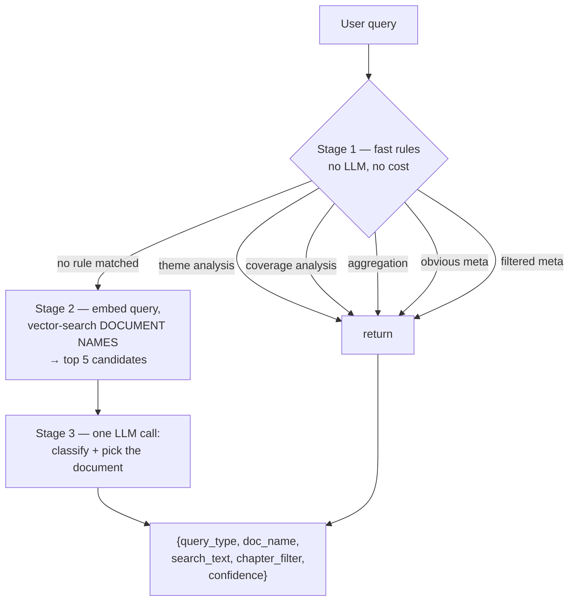

**The eight query types:**

| Type | Meaning |
|---|---|
| `meta` | List or count documents — **no RAG needed at all** |
| `specific_doc` | A question about one named document |
| `general` | Cross-document or general ISO question |
| `search_only` | Return raw chunks, generate no answer |
| `aggregation` | Count/list items inside documents (requirements, test cases) |
| `coverage_analysis` | Which ISO clauses are **not** covered by any document |
| `theme_analysis` | "What are the main issues?" — ranked full-text + a stratified sample → themed summary |
| `unknown` | Gibberish. Say so rather than inventing an answer |

Two rules worth remembering:

* **Rule-based paths return immediately** with `router_rule` set and no LLM call. That is
  the cheap path, and it is deliberately checked first.
* **`doc_name` must be EXACT**, chosen from the candidate list. A near-miss name is the
  single most common cause of an empty answer.

#### 2.6.4 Answering — the streaming pipeline

`rag_answer_stream()` streams **NDJSON** so the user watches the work happen instead of a
spinner.

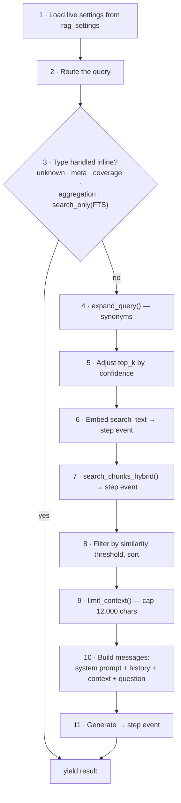

**Step events** carry a stable `key` — `routing`, `embedding`, `search`, `generating`.
⚠️ **The frontend matches on `key`, never on the display text.** Change the text freely;
never change the key.

**Retrieval detail:**

| | |
|---|---|
| Search | **Hybrid** — pgvector cosine **+** full-text `tsvector`, merged with **RRF**. Falls back to pure vector if there is no keyword query |
| Scope | Always filtered to the `repository_id` |
| Threshold | Similarity filter applied **after** search, default `0.20`. 0.20+ passes; **0.60+ is good relevance** |
| Context cap | 12,000 characters |
| **Dynamic `top_k`** | Confidence `< 0.5` → `top_k × 2` (cast a wider net). Confidence `> 0.8` **with** a document filter → `max(3, top_k // 2)` (we already know where to look) |

#### 2.6.5 Prompts and settings — all live, none hard-coded

| Where | What |
|---|---|
| `rag_settings` table | Read **live on every request**, so a change takes effect with no deploy: `answer_temperature`, `router_temperature`, `fuzzy_match_threshold`, `chat_model`, `embedding_model`, `top_k_chunks`, `similarity_threshold`, `chunk_size`, `chunk_overlap`, `enable_debug_logging` |
| `ai_prompts` (Traceability) | Product Knowledge and AI prompts — **admin-write, everyone-read**, and the gate **fails closed** |
| Router system prompt | Built per request from the candidate list + classification rules, and **returned in the result** so the debug panel can show exactly what was asked |

#### 2.6.6 Debuggability is a designed feature

Every result event carries the full router trace: `confidence`, `router_rule`,
`router_candidates` (with similarity scores), `router_system_prompt`, `router_user_message`,
`router_raw_output`, plus `llm_engine` and a token/cost breakdown.

> ⚠️ **If you add a new early-exit path that yields a result, you must spread
> `**_router_debug` and `"llm_engine"` into it.** Forgetting is not a crash — the debug
> panel simply shows *"No LLM call"*, incorrectly. A silent wrong answer, which is the kind
> of bug this whole document keeps warning about.

#### 2.6.7 When it goes wrong

| Symptom | First thing to check |
|---|---|
| "0 chunks searched" / "information not available" | The router returned a `doc_name` that matches no document. `GET /documents?repository_id=X` to see the real names; check `name_vector` is populated — if not, **re-index** |
| All similarity scores low | Re-index, and verify the embedding model still matches the one the chunks were embedded with |
| Debug panel says "No LLM call" on a routed query | An early-exit `result` is missing `**_router_debug` |
| Google Drive indexing stops early | 3 consecutive errors halt it — read the **first** error in the progress log, not the last |

---

## 3. Environments — Fly, Vercel, Supabase, Cloud Run, IIS

### 3.1 What each one gives us

| Environment | We use it for | What it is good at | What it cannot do |
|---|---|---|---|
| **Vercel** | Account Management (full Next.js app), Ask Paul frontend, covaris-bom, quiz-management | Push to `main` = deployed. Free SSL, global CDN, preview deploys per branch. Zero servers to run. | **No long-running work.** Functions have a time limit. **IPv4 only** — it cannot reach `db.<ref>.supabase.co`, which is IPv6-only. No ODBC driver. No disk. |
| **Fly.io** | Traceability Matrix — **two separate apps, one per region** (`traceability-matrix` in `iad`, `traceability-matrix-eu` in `fra`). Each is one container: FastAPI + React + SQLite | A real always-on machine with a **persistent volume**. Background jobs that run for minutes survive. Cheap. Litestream continuously replicates SQLite. A volume being pinned to one region is what makes per-region residency possible at all (§5.3) | One machine **per app**. **Never `fly scale count 2`** — Fly gives the second machine its own volume, and you silently get two divergent databases. That is also why an EU region is a second *app*, not a second machine |
| **Google Cloud Run** | Ask Paul backend | Containers, autoscaling, Secret Manager, Cloud Build CI. Handles streaming responses well. | Cold starts. Config lives in Cloud Build triggers and Secret Manager, so it is easy to set something on the running service and have the next build erase it. |
| **Supabase** | Master database + one project per Ask Paul tenant | Postgres + **pgvector** + PostgREST + a Management API that can **create projects by API**. | PostgREST cannot run DDL — schema changes need a direct Postgres connection or the Management API `database/query` route. Direct-connection hostnames are IPv6-only. |
| **IIS (customer site)** | Traceability Matrix, installed on the customer's own Windows Server | The customer keeps all data on-premises. No internet dependency. | Manual install and manual upgrade. Needs URL Rewrite + ARR. `/admin` is only reachable on the server itself. |

### 3.2 The differences that actually bite

1. **A Vercel environment variable change does nothing until you redeploy.** Vercel
   snapshots variables into each deployment. Change the value, reload the site, and you
   still see the old one — then an unrelated code push picks it up and it looks like the
   code fixed it. Order is always: **change the variable, then redeploy.**
2. **Fly restarts the machine when you set a secret.** `fly secrets set` restarts, which
   invalidates every issued admin token. That is usually fine, but know it before doing it
   mid-day.
3. **Cloud Run secrets must be in `cloudbuild.yaml`,** not just on the running service.
   `gcloud run services update` works immediately and is erased by the next build.
4. **Some settings fail loudly, some fail silently.** `JWT_SECRET` missing = container will
   not boot (obvious). `ASK_PAUL_SSO_SECRET` missing = app runs perfectly and only one
   button fails (invisible for weeks — this actually happened).
5. **Vercel cannot open a direct Postgres connection to Supabase.** `db.<ref>.supabase.co`
   publishes only an AAAA (IPv6) record; Vercel functions are IPv4. The error is
   `getaddrinfo ENOTFOUND`, which reads like a typo in the hostname. The fix is the
   **pooler** host `aws-0-<region>.pooler.supabase.com:5432` with user `postgres.<ref>`.
6. **A second Fly region inherits the CODE but none of the SECRETS.** `fly deploy -c
   fly.eu.toml` ships the identical image; secrets are per-app, write-only, and there is no
   "copy from". The features that go missing are exactly the ones written to fail closed, and
   nothing reports the drift. This has already cost us a support call — §5.8.

### 3.3 Where everything is, in one table

| Thing | Host | Address |
|---|---|---|
| Ask Paul frontend | Vercel | https://askpaul.orcanos.ai |
| Ask Paul backend | Cloud Run (`us-east4`) | service `orcanos-qms` |
| Traceability Matrix — **US** | Fly.io (`iad`) | https://traceability.orcanos.ai · `traceability-matrix.fly.dev` |
| Traceability Matrix — **EU** | Fly.io (`fra`) | `traceability-matrix-eu` · deployed with `fly deploy -c fly.eu.toml` |
| Account Management | Vercel | https://accounts.orcanos.ai |
| Master database | Supabase | project `jjiavhexvfahboiodomv` |
| Per-tenant vector DBs | Supabase | one project per account, created on demand |
| Orcanos QMS itself | Orcanos hosting | `https://app.orcanos.com/<tenant>` |
| Bedrock LLM gateway | Orcanos AWS | `https://br.orcanos.com/ext/chat` |
| Help sites | GitBook | orcanos.gitbook.io |

### 3.4 Choosing a platform for a **new** app

The three sections above describe what we run today. This is the menu for something new.
The choice comes down to three questions: **does it need a database?**, **does it need
direct access to the Orcanos database, or only the API?**, and **how sensitive is the
data?**

| Platform | Use it for | Frontend | Backend |
|---|---|---|---|
| **Orcanos AWS** | Apps needing **direct database access**, or part of the existing legacy estate. ⚠️ **Must not hold confidential customer data** unless that is explicitly cleared | Separate deploy | EC2 / Lambda |
| **Vercel** | Addons that use **only the Orcanos API** — no direct DB. Fast, zero-config. The default for a new lightweight addon | Vercel CDN | Vercel serverless |
| **Supabase** | The app needs **its own database**. Great for full apps and for prototyping — the DB can be migrated to Orcanos AWS for production | Vercel | Supabase (+ Cloud Run) |
| **Railway** | General backend hosting — services with **persistent processes or workers** running continuously | Vercel | Railway service |
| **Fly.io** | The app needs **full storage together** — app, interactive files and a database. When Supabase is too limited and Orcanos AWS too heavy | Served by the Fly app | Fly VM + volumes |

> **Quick rule:** API-only → **Vercel**. Needs a DB → **Supabase** (prototype) or **Fly**
> (production). Legacy or direct DB access → **Orcanos AWS**.

Railway is on the menu but **nothing runs on it today**. Adding a sixth platform is a real
cost ([chapter 21](#21-future-stay-on-vercelfly-or-move-everything-to-orcanos-aws)) — reach
for one we already operate unless the persistent-worker case is genuine.

---

## 4. Single-tenant vs multi-tenant

This is the single biggest architectural difference between our two main apps, and it
explains most of the other differences.

> **Since 2026-09-10 there is a third axis: the region.** Traceability is multi-tenant
> **within** a region and has one database **per** region — the two share nothing. Ask Paul
> is single-tenant, and each customer's database is created in the Supabase region matching
> their account. Read [chapter 5](#5-data-residency--eu-and-us) alongside this one.

### 4.1 Ask Paul — a database per customer (single-tenant data)

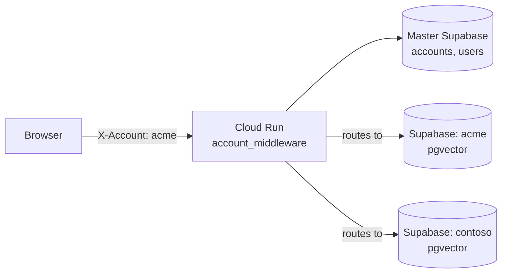

* Every API call carries an `X-Account` header.
* Middleware looks the account up in master (case-insensitively), rejects it with **403**
  if unknown or inactive — it never falls back silently.
* It decrypts that account's vector-DB key and its LLM key into **ContextVars**, so every
  downstream call in that request automatically hits the right customer database.
* **Users are global.** The `users` table lives only in master, keyed by email. Per-tenant
  tables store the user id as a plain number with no foreign key — there is deliberately
  **no `users` table** in a tenant database.

**Why:** a customer's documents and embeddings are physically separated. Strong isolation,
easy to delete a customer, easy to reason about for an auditor. The cost is that every new
customer is a real, billable Supabase project that must be provisioned.

### 4.2 Traceability Matrix — one database for everyone (multi-tenant data)

* **One SQLite file serves every account.** Rows carry an `account_id`; the tenant name is
  the Orcanos `Virtual_dir`.
* `account_id = sha256("<url>|<virtual_dir>")[:32]` — computed locally.
* **Writers are the scarce resource.** SQLite has one writer. WAL mode is mandatory, not an
  optimisation, because a `matrix_cache` blob can exceed 1.4 MB and a session refresh
  writes on every authenticated request.
* Cache is **budgeted per account** (`DB_CACHE_BUDGET_MB`) and the oldest pages are evicted
  so one busy tenant cannot fill the disk. Eviction only costs speed.
* Access is gated by an **allowlist table** managed from `/admin`. ⚠️ **An empty allowlist
  table means the gate is OFF.**

**Why:** it started as an on-premises IIS app where per-customer databases made no sense.
It is cheap and fast. The cost is that isolation is enforced by code, not by the database,
so every query must be account-scoped — and a missed scope is a data leak.

### 4.3 ⚠️ The same customer has two different tenant IDs

Traceability computes its own hashed `account_id`. Master Supabase has its own
`accounts.id`. **They do not match.** Any consolidation needs an explicit mapping table and
a backfill. This is easy to miss because both systems work perfectly on their own.

---

## 5. Data residency — EU and US

> **Added 2026-09-10.** This is the largest change to the platform since it was written down.
> The full account of it is in
> [`CHANGES-2026-09-09-REGIONS.md`](CHANGES-2026-09-09-REGIONS.md).

### 5.1 The rule

Every account has a **data region** — `us` or `eu` — stored once in `accounts.region` on the
**master** Supabase, and read by all three apps. **A customer has one region, not three
settings that can drift apart.**

It is **chosen when the account is created** and **cannot be changed afterwards** by editing
the field. Neither a Supabase project nor a Fly volume can be moved between regions, so
rewriting the value would move no data — it would only record the customer as living somewhere
they do not, while the console asserts a residency guarantee that is false. Moving a customer
is a physical migration (§5.5).

### 5.2 Why — what is actually being protected

Orcanos holds the requirements, but **our own databases hold their own copies of personal
data**:

| Where | What personal data |
|---|---|
| `matrix_cache` / `source_cache` / `funnel_cache` | Trainee **names, emails, roles, completion dates** |
| `quiz_attempts` / `quiz_answers` | Somebody's **exam record** — the one thing Orcanos cannot rebuild |
| `sessions.auth_header` | The user's **real Orcanos credential**, encrypted |
| Ask Paul's per-customer Supabase | The customer's **document text and its embeddings** |

We are the **processor**; the tenant is the **controller**.

### 5.3 The shape: one deployment per region

**There is no "EU mode". There is an EU deployment.** A Fly volume is pinned to one region and
is never shared between machines, so `fly scale count 2` does not produce a region — it
produces **two divergent databases with nothing reporting the split**.

| | US | EU |
|---|---|---|
| Fly app | `traceability-matrix` | `traceability-matrix-eu` |
| Config | `fly.toml` | **`fly.eu.toml`** |
| Region | `iad` — Virginia | `fra` — Frankfurt |
| Volume / SQLite / Litestream bucket | its own | its own |
| Replication between them | **none — that is the feature** | |

```bash
fly deploy                    # US
fly deploy -c fly.eu.toml     # EU
```

⚠️ **`deploy.bat` deploys the US app only.** A release is not shipped until both commands have
run. Both regions serve real customers off the same build, so a version drift produces no
error anywhere — only a customer in one region seeing something the other cannot.

**`SELF_REGION`** is the whole of an instance's identity. Two apps sharing one value is a
deployment mistake nothing else would catch, so `GET /api/admin/regions` returns `self_region`
and the console checks it.

#### ⚠️ Two setup steps that silently void the whole thing

1. **The Litestream bucket.** Tigris distributes objects **globally by default**, so an EU
   database's write-ahead log lands on US edges while every other part of the deployment looks
   correct. Restrict the bucket to EU regions, or point `LITESTREAM_BUCKET` at an EU-only
   S3/R2 bucket. **Nothing in the app can detect this.**
2. **A fresh region is an open door until its allowlist has one row.** An empty `account_access`
   fails open by design — right for a first install on a laptop, exactly wrong for a new public
   Fly app. `traceability-matrix-eu` answered *allowed* to **every** tenant for the minutes
   between its first deploy and its first row. Write the **denied sentinel row**
   (`zz-gate-closed`, `allow_access: 0`) **before announcing the URL** — it makes the count
   non-zero and therefore turns the gate on without granting anything.

### 5.4 The signpost, and the automatic hand-off

Each instance holds only its own region's tenants, so an EU tenant has **no `account_access`
row in the US database at all** — and the old code told them *"Access is not allowed. Please
contact us to open an account."* False, and a dead end.

**`account_region`** is a two-column **directory** (tenant → region) held **identically in
every instance**. A tenant name and a region string — **no personal data**, so copying it
across the border transfers nothing.

> ⚠️ **It grants nothing, and that is load-bearing.** `account_access` is still the only
> permission gate; `region_check()` treats a missing entry as *"no idea"*, never as *"here"*.
> That is what makes the console's cross-region write safe to do **best-effort** — a missing
> signpost costs a worse error message, never access. **Never consult the directory in a gate.**

**The hand-off happens before the password is submitted.** Credentials POSTed to the wrong
region are themselves a cross-border transfer of personal data, even though that instance
refuses them and stores nothing. So the check hangs off `POST /api/auth/check-account`, which
already fired on URL blur; `/login` enforces it as **409 with the correct URL**, not 403 —
nothing is wrong with the account, the request arrived at the wrong deployment.

Since 3.45.0 the customer is **redirected automatically**, carrying the Orcanos URL they typed
so they do not type it twice. Which region holds their data is **our** implementation detail.

- **`rr=1` is a loop guard, and it is not theoretical.** The two instances hold separate copies
  of the directory. If they ever disagree — a half-finished move, a directory write that failed
  on one side — an automatic redirect bounces the browser between two servers forever, each
  certain the customer belongs to the other. Arriving with the flag set means *"you have been
  sent once already"*: show the panel with a link and let a person decide.
- ⚠️ **The address bar does change.** A true single origin would need an edge proxy in front of
  both apps, which puts a third processor in the path of every EU request.

### 5.5 Moving a tenant between regions

The two regions share no data, so *"move to the EU"* is a **physical migration**, not a flag
(`tenant_move.py`, driven from the Account Management console).

```
freeze → export → import → COMPARE ROW COUNTS → restore access → update master + directory → purge
```

**Order is the safety.** The purge is **last**, so a short import stops the move with the
source fully intact. The import is **one transaction** — a half-landed import is the state that
would make *"may I delete the source?"* unanswerable.

| Decision | Why |
|---|---|
| The table list is **discovered from the schema**, never written down | It grows every few releases; a hand-maintained list is correct the day it is written and silently short after — and short here means a customer's quiz attempts stay on the wrong continent while the move reports success |
| **Two keys, both needed** | One tenant can own several `accounts.id` rows (unique on `(url, virtual_dir)`, so the same tenant on two hosts is two rows), and three tables key on the tenant **name** |
| **`sessions` never travels** | It holds the Orcanos credential under a key deliberately different per region, so a moved row would be undecryptable. It **is** purged from the source — that is the point |
| **Caches DO travel** | They look disposable and are not: a training report renders the snapshot and never re-reads Orcanos, so dropping them discards the evidence behind training records already signed off |
| **Ask Paul does not move** | Its vector database is a Supabase project, which cannot be relocated. The response says so rather than leaving it to be found later |

Everyone signed in is signed out. The console requires the tenant name to be typed, and shows
the seven steps ticked off with the row counts actually moved.

### 5.6 Ask Paul and the region

`provision_account(account_name, data_region)` maps the region through
`SUPABASE_REGION_BY_DATA_REGION` (`us` → `us-east-1`, `eu` → `eu-central-1`) and creates the
customer's vector database there. `POST /admin/accounts` **400s** on a missing or invalid
`region` and writes it to the account row in the same request, so the recorded region and the
region the project was created in cannot disagree.

⚠️ **The bug this fixed was invisible.** The signature used to be `provision_account(name,
region="us-east-1")` and the only caller never passed it, so **every customer ever provisioned
from this app landed in Virginia**, whatever they had contracted for. A database in the wrong
region works perfectly — every query succeeds, nothing reports it. **The default was removed
rather than corrected**, because a correct default is still a default: the next caller that
omits the argument gets a silent residency decision made for it. See `REQ-047`.

### 5.7 ⚠️ What is NOT residency yet

**An EU vector database while the backend and embeddings are in the US is a residency claim
that reads as true and is not.** Do not tell a customer we have EU residency for Ask Paul.

| Part | State |
|---|---|
| Traceability app + database | ✅ per-region deployment |
| Ask Paul vector DB region | ✅ per-account, chosen at creation |
| Ask Paul FastAPI backend | ❌ **one Cloud Run service, `us-east4`** — every EU customer's questions and document text are processed in the US |
| Embeddings | ❌ **always OpenAI on the platform key**, no per-account override |
| Chat LLM | ⚠️ per-account engine; only `bedrock_claude` uses an EU inference profile — the Anthropic / OpenAI / Gemini branches are US |
| Traceability AI calls | ❌ **not region-routed** — panel-describe, trace-build and quiz-generation send requirement text and trainee names to the US Anthropic API |
| SSO into Ask Paul from the EU app | ❌ deliberately unconfigured — §5.8 |
| EU Litestream bucket restriction | ⚠️ **unverified from the CLI** |

A US call for an EU tenant returns a perfectly normal answer, which is exactly the problem.

### 5.8 ⚠️ The secret-parity trap

`fly deploy -c fly.eu.toml` ships the **identical image**. What it does **not** ship is the
other app's secrets — those are per-app, write-only, with no "copy from". So a second region
comes up running the same build with a **different set of features switched on**, and nothing
anywhere says so.

Found the ordinary way: a tenant was moved US → EU, signed in, and **Ask Paul was gone.** The
move was flawless — the licence row said `1`, verified in the EU database. The button was
hidden because `ASK_PAUL_APP_URL` / `ASK_PAUL_SSO_SECRET` had never been set on the EU app.

> **The features that vanish are exactly the ones written to fail CLOSED.** That is correct
> behaviour (§8), but "fails closed" plus "new region" reads to the customer as **a licence
> they paid for that is missing**, and to the operator as a bad move.

**Secret parity is not the goal — a decision per secret is:**

| Secret | US | EU | Decision |
|---|---|---|---|
| `ADMIN_PASSWORD`, `SECRET_KEY` | set | set | **Different per region.** One leak must not open both |
| `SESSION_ENC_KEY` | set | set | **Must differ** — the databases never travel together |
| `AWS_*`, `BUCKET_NAME` | set | set | **Must differ** — and the EU bucket must be EU-restricted |
| `ADMIN_DB_BROWSER` | set | set | Same value is fine — a flag, not a credential |
| `ASK_PAUL_APP_URL` / `ASK_PAUL_SSO_SECRET` | set | **unset** | ⚠️ Needs an **EU Ask Paul** first. Do **not** point EU at the US app |
| `ANTHROPIC_API_KEY` | set | **unset** | ⚠️ Regional Bedrock endpoint — not the US key |

**The two unset rows are a residency decision, not an oversight.** An operator who finds them
blank at 2 a.m. will "fix" them by copying, because copying is what parity means everywhere
else. Wiring either in sends EU personal data to the US **through a deployment whose entire
purpose is that it does not** — a breach that looks like a feature working.

---

## 6. Working with Orcanos web services

Everything ultimately talks to the Orcanos QMS REST API. **Read the `orcanos-api` skill
before writing any integration code** — it documents the quirks below and about 100
endpoints.

### 6.1 The basics

| | |
|---|---|
| **Base URL** | `https://app.orcanos.com/<tenant>/api/v2/Json/` (tenant = `Virtual_dir`, e.g. `orca60`, `orcanosdemo`, `orcanos`) |
| **Auth** | HTTP **Basic** with the user's Orcanos credentials, or an API key |
| **Style** | POST with a JSON body, even for reads |
| **CORS** | **There are no CORS headers.** A browser cannot call Orcanos directly — a server-side proxy is mandatory. |

### 6.2 The quirks that have cost us releases

* **XML-wrapped arrays.** Responses are XML converted to JSON, so a list of one item comes
  back as an object, not an array of one. Always normalise.
* **`Display_text` vs `Text`** on picklists — the two are not interchangeable.
* **Item id shape is `"46584 (42195)"`** — a key plus a numeric id in brackets. Parse it,
  never compare raw strings.
* **Pagination has exact required settings**; get them wrong and you silently receive a
  partial set that looks complete.
* **`GetFilterList` matches the item type's display *label*, spelled exactly** — not its
  code.
* **"Changed since" queries** are possible in `Filter_By`, but only on a column the filter
  actually selects, and only with `ISNULL`.
* **Orcanos item fields are untrusted input.** Anyone who can edit an item controls names,
  descriptions and custom fields. Treat them as hostile in any sink.

### 6.3 We have three separate Orcanos clients

`covaris-bom/src/api/orcanosClient.js`, Ask Paul's `backend/api.py`, and
`traceability-matrix/src/backend/orcanos_client.py`. Each independently rediscovered the
same quirks. **One shared client is the highest-value piece of de-duplication available to
us** — see chapter 22.

---

## 7. Authentication

### 7.1 The four ways in

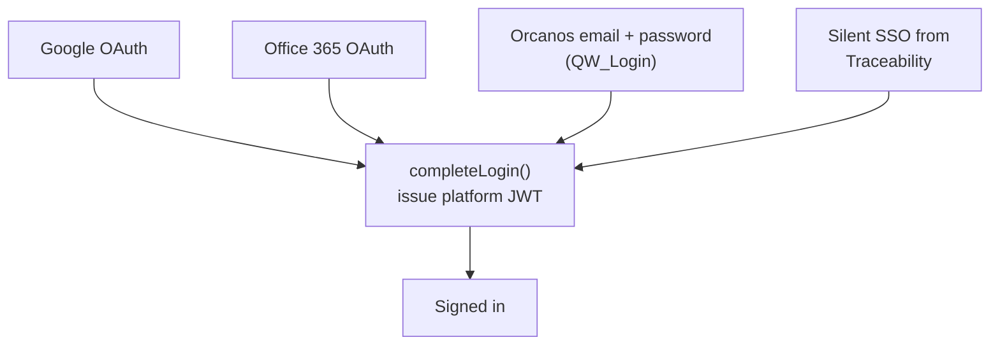

| Method | How it works | Where the token goes |
|---|---|---|
| **Google** | Standard OAuth2 authorization-code flow. The app builds the Google URL, the server exchanges the code. A CSPRNG `state` value is round-tripped to block authorization-code injection. | Ask Paul: `localStorage`. Account Management: **httpOnly cookie**. |
| **Office 365** | Same flow, Microsoft endpoints, per-account tenant ID. | Same. |
| **Orcanos email** | The password is verified by **`QW_Login` against the tenant's own Orcanos**, not against a stored hash. Orcanos is the sole credential authority. | Same. |
| **Silent SSO** | See [chapter 8](#8-silent-login-to-ask-paul-cross-app-sso). | Same. |

All four converge on the same tail, which issues the **same HS256 JWT**. The
`auth_method` claim records which door was used.

### 7.2 Google sign-in, specifically

1. The app calls `GET /api/auth/config` (public) to find out which methods this account has
   enabled — this reads the `auth_methods` table.
2. The user clicks *Sign in with Google*. The app generates a random `state`, stores it, and
   redirects to Google.
3. Google returns to our **redirect URI** with a `code`.
4. The server exchanges the code for the user's identity, checks the `state` matches, then
   issues our own JWT.

Two things to know:

* **The redirect URI must be registered on the OAuth client of the account named by
  `PLATFORM_ACCOUNT`.** In Account Management that is `https://accounts.orcanos.ai/auth/callback`.
* **The `state` check is a hard failure in Account Management.** Ask Paul used to skip it
  when no local state existed, for compatibility with an old path. There is no old path in
  Account Management, so skipping would only create a CSRF hole.

### 7.3 The staff gate (Account Management)

```
user.role === 'admin'  &&  user.email endsWith '@orcanos.com'
```

Three properties that must never be weakened:

1. **API routes answer 404, not 403.** A non-staff caller must not learn the routes exist.
2. **`role` and `email` are read from the database on every request**, never trusted from
   the JWT claims — so revoking an admin takes effect immediately, not in 24 hours.
3. **The page-level check is not the boundary.** Pages redirect for user experience; the
   route handlers are what actually protect data.

### 7.4 The login error message is deliberately useless

Every failure path in Orcanos email sign-in returns the same `Invalid credentials` —
missing user, wrong password, wrong tenant, not an admin, identity already linked. That is
on purpose: the route cannot be used to enumerate users.

> 🔎 **When someone reports a login problem, read the `security_audit_log` table.**
> The real reason is recorded there and **only** there. The screen cannot tell you anything.

### 7.5 Where the differences still are

| | Ask Paul | Traceability | Account Management |
|---|---|---|---|
| Token storage | `localStorage` | its own **session row** + httpOnly cookie | httpOnly cookie |
| CSRF defence | token in header | explicit `X-CSRF-Token` | `SameSite=Lax` + same-origin JSON |
| Session length | 24 h JWT | 45 min sliding (`SESSION_TIMEOUT=2700`) | 24 h JWT |
| Orcanos calls made as | one account-level credential | **the end user** | account credential |

Unifying these is [step 4 of the consolidation plan](#21-future-stay-on-vercelfly-or-move-everything-to-orcanos-aws).
Note that "as the end user" vs "as the account" changes what Orcanos records in **its own**
audit trail — which matters in a regulated QMS.

---

## 8. Silent login to Ask Paul (cross-app SSO)

A user already signed in to Traceability clicks **Ask Paul** and lands in Ask Paul already
signed in.

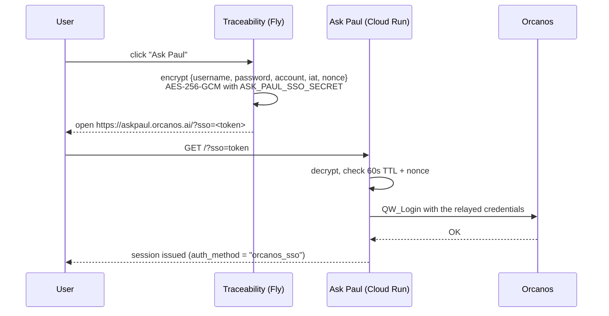

**The design rule:** the shared secret protects the **channel**, not the authentication.
The token carries **real credentials that are re-verified**, never an assertion of "this
user is fine". A forged or replayed token can at most attempt a real Orcanos login with
credentials it already knew.

| Property | Value |
|---|---|
| Secret | `ASK_PAUL_SSO_SECRET` — base64, 32 random bytes, **separate** from `ENCRYPTION_KEY` |
| Token | `base64url(12-byte nonce + AES-GCM ciphertext)`, passed as `?sso=` |
| Lifetime | **60 seconds**, plus a best-effort single-use nonce check |
| Recorded as | `auth_method = "orcanos_sso"` (vs `"orcanos"` for the direct form) |

### It needs three settings, in two clouds

| Where | Setting | Effect if missing |
|---|---|---|
| Fly — traceability-matrix | `ASK_PAUL_APP_URL` | Button does not appear |
| Fly — traceability-matrix | `ASK_PAUL_SSO_SECRET` | Button does not appear |
| Cloud Run — orcanos-qms | `ASK_PAUL_SSO_SECRET` (byte-identical) | **Button appears and the click fails** |

⚠️ **This is the classic silent failure.** Ask Paul boots and runs perfectly without the
secret; only `/auth/sso/consume` answers *"SSO is not configured for this deployment"*.
Configuring one side makes the door visible; only configuring both makes it open. It must
be on the `--update-secrets` line in `cloudbuild.yaml`, or the next build erases it.

### Three more prerequisites, each with its own error

* The account row must exist and have an `orcanos_api_url`.
* Its `auth_methods` row must have `local_enabled = true`.
* The **account name is not the Orcanos tenant name** — `orca60` was "Medical Portal",
  `orcanosdemo` was "demo". Traceability keeps a mapping.

Also worth knowing: the button is a **licence, not a switch**. Three separate gates are
ANDed — the account's `allow_ask_paul` column, the user's Orcanos `O` permission letter,
and the deployment secrets above. Only the last one fails closed, so the Account Management
pill can read "licensed" while the button is hidden from everyone.

> ⚠️ **Diagnose a hidden button in this order, or you will blame the wrong layer.** Only the
> first cause is visible in the Account Management console:
>
> ```
> ask_paul_enabled = allow_ask_paul        (the ACCOUNT's licence — console + /admin)
>                  AND can_ask_paul        (the USER's Orcanos "O" letter — fail-open)
>                  AND ask_paul_configured (THIS DEPLOYMENT's two secrets — fail-CLOSED)
> ```
>
> Check `fly secrets list` **before** touching a licence. Since 2026-09-10 there are **two
> Traceability deployments**, and the EU one deliberately has neither secret set (§5.8) —
> so for an EU tenant the button is hidden by design, and the licence row still says `1`.
> This has already been mistaken for a failed region move.

---

## 9. Caching — quick cache and slow cache

Building a matrix or a training report means many Orcanos calls and can take minutes. So
**almost nothing is built when you look at it.** Understanding the two speeds is the single
most useful operational thing to know about Traceability.

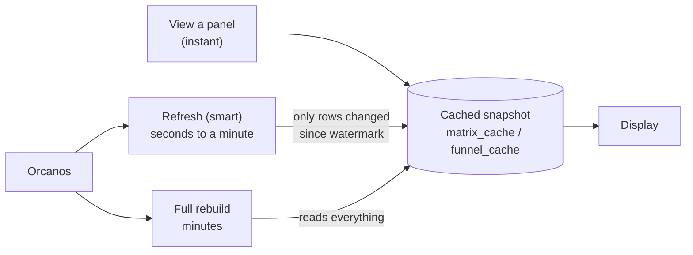

| Speed | What it does | When it runs |
|---|---|---|
| **Quick cache — read** | Serves the stored snapshot. **Never** calls Orcanos, never builds. If there is no snapshot the answer is "not cached", *not* an error. | Every normal page view, dashboard card and report |
| **Slow cache — smart refresh** | Re-reads only rows Orcanos reports as created or updated since the last build (a **watermark**), merges them into the stored corpus, rescores. Returns a `job_id` you poll. | The Refresh button |
| **Slow cache — full rebuild** | Reads every level, every page, from scratch. | First build, or when smart refresh cannot be trusted |

### Rules that matter

* **Smart refresh escalates to a full rebuild by itself**, inside the same job, and says
  why: no stored rows, no Updated/Created date column in the filter, a source that errored
  or truncated, or a merged row count that no longer matches the filter's own
  `Total_records` — which is the only signal a **deletion** produces.
* **An export renders the snapshot.** It never re-reads Orcanos and never builds. So an
  export is exactly as fresh as the last refresh, no more.
* **Quiz results are overlaid at read time**, so a newly passed quiz shows without a
  rebuild while the cached JSON stays pure Orcanos.
* **A background job outlives the page that started it.** Closing the tab kills the
  *polling*, not the job. `GET /api/matrix/{id}/active-job` is how a returning page
  re-attaches.
* **One job per user** is enforced, and exports have their own slot so a download cannot
  block a rebuild.
* **Cache is disposable.** `matrix_cache`, `funnel_cache`, `export_jobs`, `ai_jobs` and
  `pending_traces` can all be deleted; they rebuild. That is why they are also the tables
  we would *not* migrate to Postgres.

### If someone says "the data is wrong"

Ask in this order: (1) When was it last refreshed? (2) Is the change inside the panel's
filters? (3) Was the change a **deletion** — those only surface via the count mismatch.
(4) Only then look for a bug.

---

## 10. Databases, and converting SQLite to Postgres

### 10.1 What we run

| Store | Used by | Notes |
|---|---|---|
| **Supabase Postgres (master)** | all apps | Identity, tenant registry, encrypted secrets, spend, audit |
| **Supabase Postgres per tenant** (pgvector) | Ask Paul | Documents, embeddings, conversations. No `users` table by design |
| **SQLite on a Fly volume** | Traceability | WAL, single writer, Litestream replication. **One database per region** since 2026-09-10 — the US and EU files share nothing (§5.3) |
| **Customer SQL Server** | Ask Paul (read-only) | Reached with `mssql`/tedious, because Vercel has no ODBC driver |

**Tables added by the residency work (2026-09-10):**

| Table | Where | What it is |
|---|---|---|
| `accounts.region` | master Supabase | `'us'` \| `'eu'`, one per account. The `'us'` default is a **backfill for pre-residency rows**, not a default for new ones. Migration `sql/003_account_region.sql` |
| `account_region` | **every** Traceability instance | The cross-region directory (tenant → region). Grants nothing — §5.4 |
| `admin_blocked_ips` | each Traceability instance | Permanently blocked admin-login IPs — §13.5 |

### 10.2 Changing schema on Supabase

PostgREST **cannot run DDL**. Do not hand-edit in the SQL editor — you lose the record of
what was run. Use the Management API and keep the `.sql` file as the source of truth:

```
POST https://api.supabase.com/v1/projects/<ref>/database/query
Authorization: Bearer $SUPABASE_ORG_ACCESS_TOKEN
body: {"query": "<contents of the .sql file>"}
```

Write every migration as `create table if not exists` / `add column if not exists`, so
re-running one is a no-op.

⚠️ **`accounts` has five NOT NULL columns with no default.** A `tsc` build cannot see a
database constraint. Verify a new insert shape by actually running it against the live
table and deleting the row.

### 10.3 Converting the SQLite database to SQL / Postgres

Two different questions people mean by this.

**(a) "Give me the SQL / a copy of the data."**

```bash
# a full text dump you can read, diff or re-import
sqlite3 traceability.db .dump > traceability.sql

# schema only
sqlite3 traceability.db .schema > schema.sql

# one table to CSV
sqlite3 -header -csv traceability.db "select * from trace_setups;" > trace_setups.csv
```

⚠️ **Stop the backend first.** The database runs in **WAL** mode, so the newest writes may
still be in a `traceability.db-wal` sidecar file. A clean shutdown folds the WAL back in and
makes a plain file copy complete. If the process was killed and a `-wal` file is present,
copy `traceability.db-wal` and `traceability.db-shm` **alongside** the `.db` — copying the
`.db` alone silently loses the most recent panels.

**(b) "Move it to Postgres."**

Do **not** think of this as "port a database". The 15 tables are not equally precious —
classify first:

| Class | Tables | What to do |
|---|---|---|
| **Cache — disposable** | `matrix_cache`, `funnel_cache`, `export_jobs`, `ai_jobs`, `pending_traces` | **Leave in local SQLite indefinitely.** This is most of the write volume and it *wants* to be node-local. |
| **Config — small, precious** | `trace_setups`, `user_projects`, `products`, `product_projects`, `product_sources`, `ai_prompts`, `ai_config`, `account_access` | The only data that genuinely must move. Small, low write rate. |
| **Session — about to disappear** | `sessions` | Do not migrate it. It evaporates when Traceability adopts the platform JWT. |
| **Ledger — already duplicated** | `ai_usage` | Duplicates master `account_usage_logs`. Append-only, so it is the **safest first migration** and it proves the pipe. |
| **Tenant registry — conflicting** | `accounts` | Must be **reconciled**, not copied — see [§4.3](#43--the-same-customer-has-two-different-tenant-ids). |

**Which Postgres?** Supabase, if we stay as we are — it is already the master and the tool
chain exists. AWS RDS Postgres if we move to Orcanos AWS ([chapter 21](#21-future-stay-on-vercelfly-or-move-everything-to-orcanos-aws)).
There is no third candidate worth the argument.

**Honest cost warning.** `src/backend/db.py` is ~1,800 lines of raw `sqlite3` — no ORM,
`sqlite3.Row` factories, `sqlite3.IntegrityError` catches, SQLite-specific SQL throughout.
A wholesale port is a large, risky, **zero-feature** change. Migrate `ai_usage` first,
then the config tables, and stop there unless something forces more.

---

## 11. Cost — how we record it and how we control it

### 11.1 The rule

> **Every Claude API call the app makes writes one ledger row, keyed on the tenant, with
> the price frozen at write time.**

### 11.2 How it works (Traceability, `ai_usage.py`)

| Rule | Why |
|---|---|
| One row per call — `ai_generate`, `dup_check`, `panel_describe`, `knowledge_build` | Complete coverage; no path is unmetered |
| **Recorded by the API endpoint, not the engine** | The engines stay pure. The endpoint is the single choke point that also covers background jobs |
| **`record()` never raises** | A bookkeeping failure must never break an AI feature or 500 a request |
| Failed calls **are** recorded (`ok=0`) | A failing account stays visible. A call that never ran records nothing |
| **Key is the tenant** (`Virtual_dir`), never `user_id` alone | `user_id` is unique only *within* a tenant. Background jobs, which only know the URL, key identically |
| **`cost_usd` computed at write time** from a price table and stored on the row | Historical spend never shifts when Anthropic changes prices or we change the model |
| Unknown model → falls back to Sonnet-tier pricing, flagged `known_model:false` | Never crash, and **never under-count** |
| Intro discounts are deliberately **not** applied | Same reason — never under-count |

### 11.3 What is *not* billed to the customer, and why

* **Ask Paul answers** — that is Orcanos AI; the tenant pays Orcanos, not us. No Anthropic
  tokens are involved from our side.
* **Bedrock gateway calls from Traceability** — the gateway is Orcanos'. Product-owner
  decision. The gateway *does* return token counts, so turning billing on later is a small
  change.
* ⚠️ **Ask Paul's own `bedrock_claude` engine is priced** the same as `claude_sonnet`
  ($3/$15 per million tokens) — the opposite of Traceability's treatment of the same
  gateway. This inconsistency is deliberate today but is worth a decision.

### 11.4 Where to look

| Question | Where |
|---|---|
| What is one account spending? | Account Management → the account's usage, or Traceability `/admin` → account → usage |
| Which accounts are spending? | `GET /api/admin/accounts` — `ai_cost_usd` and `ai_calls` per account |
| Which engine is an account on? | `GET /api/admin/engine` |
| Platform-wide history | master `account_usage_logs` |

### 11.5 The non-LLM costs, which are the ones that surprise us

| Cost | How it appears |
|---|---|
| **A provisioned Supabase project per Ask Paul tenant** | Billable from the moment it is created. **Deleting an account does not de-provision it.** |
| **Orphaned projects from failed provisioning** | A job that dies mid-run leaves a real, billable project with no account row. The finder query is at the bottom of `sql/001_account_provisioning.sql` — **run it after any failed run.** |
| Fly machine | Always-on by design (`min_machines_running = 1`), 1 GB volume |
| Cloud Run | Per request, plus Artifact Registry storage |
| Vercel | Per project |
| GitBook, domains | Fixed |

### 11.6 Development spend — the Anthropic console

The chapters above are about what our **products** spend on the customer's behalf. What
**we** spend building them lives in one place:

| | |
|---|---|
| **Usage dashboard** | `console.anthropic.com/settings/usage` — tokens per model, per day. This is where an expensive session shows up |
| **Billing** | `console.anthropic.com/settings/billing` — plan, invoices, and **spend limits** |
| **API keys** | `console.anthropic.com/settings/keys` — create, rotate, revoke |
| **Pricing** | `anthropic.com/pricing` |

Check it during long agentic sessions. The habits that actually control this cost —
matching the model to the task, starting a fresh chat instead of dragging stale context,
keeping `CLAUDE.md` current, `/compact` at 15–20 %, and answering with the terminal what
the terminal can answer for free — are in [chapter 15](#15-how-we-work-with-claude-code).

### 11.7 The centralized cost service — designed, not built

There is a full design for replacing per-project cost tracking with **one service every
Orcanos app reports into**: `orcanos-ai-cost-analysis`
(`Claude Infrastructure/orcanos-ai-cost-analysis/`, plus a v1.0 design document).

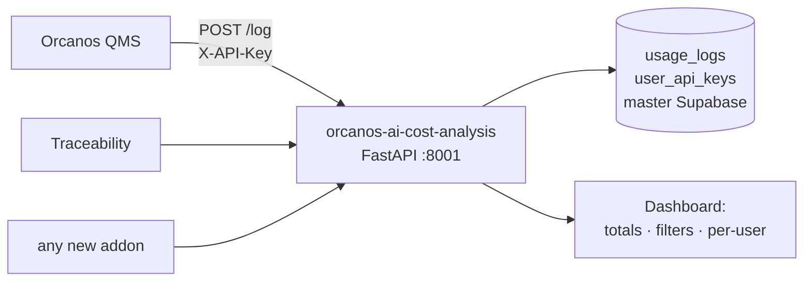

The shape of it:

* **One `POST /log` call** per AI event: `application_name`, `user_email`, `model`,
  `tokens`, `cost_usd`, plus optional `input_tokens` / `output_tokens` / `action` /
  `conversation_name` / `metadata`.
* **Per-user API keys** (`oai_<32 hex>`, one per user, regenerable from the dashboard) —
  so an app authenticates without a user session. The key is shown **masked** except once,
  on regeneration.
* **The same auth stack and the same Supabase project as Ask Paul**, so there is no second
  login system and no second `users` table.
* **A `cost-reporter` skill** that does the reporting automatically from any project's
  `CLAUDE.md` — silently, never blocking the main task, `console.warn` on failure, **never**
  retrying.
* A dashboard: total tokens, total cost, applications, active users; filters by date, app,
  model and (admins only) user; a table of every event.

**Two things to settle before building it.**

1. **It overlaps what already exists.** `ai_usage` (Traceability) and
   `account_usage_logs` (master) already record this, keyed on the **tenant**. The new
   design keys on **`application_name` + `user_email`** — a different question ("what does
   *our own* AI use cost us across apps?") than the one the live ledgers answer ("what does
   *this customer* cost?"). Both are legitimate; **decide whether it is one service with
   both keys, or two ledgers with an explicit boundary**, before writing code.
2. ⚠️ **Its price table is stale.** The design's `cost-reporter` skill lists
   `claude-opus-4-6` at $15/$75 and `claude-haiku-4-5` at $0.80/$4 per million tokens.
   Neither matches the current published rates ([§12.5](#125-which-model-a-developer-should-use)),
   and a wrong price table silently produces a wrong ledger — the exact failure the live
   implementation avoids by freezing the price at write time and never under-counting.
   **Fix the table before the first row is written.**

---

## 12. Managing the LLMs

### 12.1 One routing layer, per account

Every AI call goes through a single routing layer that resolves the calling tenant's
`ai_config` row and picks a provider. **No configuration means the old default path,
byte for byte** — an unconfigured tenant is never changed by this system.

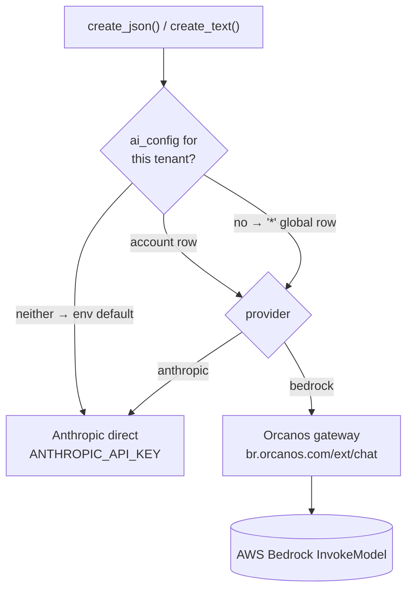

**Resolution order: account row → the reserved `'*'` global row → the environment default.**
So an admin can point every unconfigured tenant at a different engine in one place. `'*'`
can never collide with a real tenant, because a tenant name is a URL path segment.

### 12.2 The two providers

| Provider | Endpoint | Notes |
|---|---|---|
| **anthropic** | `api.anthropic.com` | Our own key. JSON schema is **enum-forced** at the tool layer, so a hallucinated value is rejected before it reaches our code. |
| **bedrock** | `POST https://br.orcanos.com/ext/chat`, header `x-api-key` | An Orcanos-owned proxy for AWS Bedrock `InvokeModel`. It serves **Claude and OpenAI** — only the `modelId` differs. |

Verified model ids on the gateway: `eu.anthropic.claude-sonnet-4-6`,
`eu.anthropic.claude-opus-4-8`, `eu.anthropic.claude-haiku-4-5-20251001-v1:0`, and the
OpenAI open-weight `openai.gpt-oss-120b-1:0` / `openai.gpt-oss-20b-1:0`.

Three traps:
* **No region prefix on the OpenAI ids** — `eu.`/`us.` are rejected.
* **`gpt-4o` and `o3` are not on Bedrock** at all.
* **The gpt-oss models emit their reasoning as `<reasoning>…</reasoning>` before the
  answer.** It must be stripped, or both the JSON parse and the free-text output are
  corrupted.

On Bedrock the JSON schema is only *prompt-instructed*, not enforced — so parsing is
defensive there.

Ask Paul additionally routes `gpt_4o` to OpenAI and `gemini_pro` / `gemini_flash` to
Google, per account, from the same kind of table.

### 12.3 Keys

* A per-account key overrides; otherwise the provider's global environment key is used
  (`ANTHROPIC_API_KEY` / `BEDROCK_API_KEY` — one shared gateway key today).
* Keys are **write-only from the admin API**. Listing shows `has_key`, never the value.
  `''` clears it (fall back to env), `None` leaves it alone.
* **Store `BEDROCK_API_KEY` in `fly secrets` / environment — never in `fly.toml`**, which
  is in git.
* **Verify before save.** The admin *Test key* button makes a tiny live call, and Save
  auto-verifies first.

### 12.4 Two rules

1. **Never reintroduce a direct LLM client inside an engine.** It bypasses per-account
   routing and per-account billing at a stroke.
2. **On a provider error we hard-fail with a clear message** — no silent fallback to the
   other provider. A misconfigured account gets fixed, not masked.

### 12.5 Which model a developer should use

Everything above is the **product's** model routing. This is the model *you* run Claude
Code with — a different decision, made in `~/.claude/settings.json` or with `/model`.

Current models and published rates (per million tokens):

| Model | Model ID | Context | Input | Output |
|---|---|---:|---:|---:|
| **Claude Opus 5** | `claude-opus-5` | 1M | $5 | $25 |
| **Claude Sonnet 5** | `claude-sonnet-5` | 1M | $2 | $10 |
| **Claude Haiku 4.5** | `claude-haiku-4-5` | 200K | $1 | $5 |
| Claude Sonnet 4.6 | `claude-sonnet-4-6` | 1M | $3 | $15 |
| Claude Opus 4.8 / 4.7 / 4.6 | `claude-opus-4-8` … | 1M | $5 | $25 |
| Claude Fable 5.1 *(most capable)* | `claude-fable-5-1` | 1M | $10 | $50 |

**How to choose:**

* **Haiku 4.5** — routine edits, Q&A, quick refactors, boilerplate, repetitive file
  changes. Anything you do more than ten times a day. Cheapest by far, but note the
  **200K context ceiling** — on a large codebase that is what runs out first.
* **Sonnet 5** — new features, multi-file refactors, debugging, writing tests. The
  everyday step up, and **cheaper than the Sonnet 4.6 it replaces**.
* **Opus 5** — major rewrites, architecture, critical production decisions, anything where
  a wrong answer costs real time.

```bash
# default, in ~/.claude/settings.json
"model": "claude-haiku-4-5"
# per session
claude --model claude-sonnet-5
# mid-session
/model claude-opus-5
```

> ⚠️ **The team deck's model table is out of date.** It documents Haiku 4.5 / Sonnet 4.6 /
> Opus 4.7 and does not mention the Claude 5 family at all. The Haiku and Sonnet 4.6 rates
> in it are still correct; Sonnet 5 and Opus 5 are missing entirely, and Sonnet 5 is
> **cheaper** than the Sonnet 4.6 the deck recommends. Update
> [the deck](#1512-the-deck-itself) and the price table in
> [§11.7](#117-the-centralized-cost-service--designed-not-built) together — model IDs and
> prices change, so state where the live source is (`anthropic.com/pricing`) rather than
> only the numbers.

---

## 13. Security — how we work

### 13.1 The standing rules

| Rule | Detail |
|---|---|
| **Secrets are server-side only** | Nothing privileged behind `NEXT_PUBLIC_`. In Account Management, no module that touches `node:crypto` or a service key may be imported by a `'use client'` component |
| **No ciphertext to the browser** | `GET /api/accounts/:id` returns an explicit column allow-list with zero `*_encrypted` columns. There is nothing to attack offline |
| **Admin routes answer 404** | A non-staff caller cannot tell they exist |
| **`role`/`email` re-read every request** | Revocation is instant |
| **Every new route starts with the gate** | `requirePlatformStaff()` is the first line, always |
| **Secrets at rest are AES-256-GCM** | Five `*_encrypted` columns on `accounts` |
| **SSRF guard on outbound calls** | `isSafeExternalUrl` blocks loopback, private ranges and cloud metadata endpoints |
| **Host allowlist on sign-in URLs** | `ORCANOS_LOGIN_HOST_ALLOWLIST` (default `orcanos.com`). ⚠️ Setting it to `*` is a pre-auth takeover of the console |
| **A disabled input is not a boundary** | The login screen's URL box is disabled but still sends its value. Client-supplied is client-supplied |
| **Audit everything security-relevant** | `security_audit_log`, shared by all apps. Writes are non-blocking but a non-2xx write is logged to the server console, not silently dropped |

### 13.2 The security skills

| Skill | Scope | Use it when |
|---|---|---|
| **`/security-review`** (built-in) | The pending changes on the current branch | Before every merge of anything security-relevant |
| **`/security-scan`** (traceability-matrix, `.claude/skills/security-scan.md`) | Full backend + frontend audit, fan-out by surface, results tracked in `SECURITY_AUDIT.md` | Periodic full audits; `/security-scan diff` for one branch |
| **`/compliance-audit`** (global) | ISO 27001:2022 controls across code, Supabase, Fly, Vercel + a static pentest pass | Getting a tool audit-ready |
| **`/multitenant-audit`** (traceability-matrix) | Every query is account-scoped | After touching any query in the shared SQLite |
| **`/code-review`** (global) | Correctness, regressions, security in changed code | Every PR |

**How `/security-scan` works — and why we trust it.** It is *verification-first*:

1. A grep hit is a **lead**, not a finding. Read the sink *and* trace the source.
2. Separate **CONFIRMED** (unsanitised sink + reachable untrusted source, both seen) from
   **PLAUSIBLE** (depends on something unread).
3. **Exploitability sets severity, not the pattern.** An IDOR on a `uuid4` is weaker than on
   a sequential integer — check which.
4. **Never fix during the scan.** Report first; fix what the user picks.
5. Findings go into a **status ledger updated in place**, not a fresh wall of text each run.

### 13.3 Handling a security finding

1. Reproduce it, or downgrade it to PLAUSIBLE honestly.
2. Record it in the project's `SECURITY_AUDIT.md` / `SECURITY_FIXES.md` with severity and
   status. **Never delete a row — change its status.** That is the audit evidence.
3. Fix it, bump the version, write the release note (**never naming a customer**).
4. Re-run the scan on the diff.

### 13.4 Known open operational risks

* **SQL Server reachability from Vercel.** Connection tests use `mssql`/tedious because
  Vercel has no ODBC driver. A customer SQL Server firewalled to the Cloud Run egress IPs
  will refuse Vercel. Confirm against a real customer account before retiring the old panel.
* **Provisioning cannot run its DDL step from Vercel** ([§3.2](#32-the-differences-that-actually-bite)).
* **An empty Traceability allowlist table means the gate is off** — and a **brand-new region**
  is exactly that state. `traceability-matrix-eu` answered *allowed* to every tenant for the
  minutes between its first deploy and its first row. Write the `zz-gate-closed` sentinel row
  before announcing any new region's URL (§5.3).
* **The audit log started empty on 2026-08-29.** Nothing before that date was ever recorded
  and nothing is recoverable.
* **Nothing detects secret drift between the two regions** (§5.8). Both serve real customers
  off the same build: no version mismatch, no error, no failing health check.
* **The EU Litestream bucket's region restriction is unverified from the CLI.** Tigris
  distributes globally by default, so an unrestricted bucket puts an EU database's
  write-ahead log on US edges while everything else looks compliant.

### 13.5 The Traceability `/admin` console (hardened 2026-09-10, v3.44.0)

`/admin` is a FastAPI route on the **same public host as the app**, registered before the SPA
catch-all. Everything below follows from that one fact: **the admin console is on the open
internet**, and one shared password stands in front of it.

* **`ADMIN_PASSWORD` no longer has a default, and must never get one again.** It used to fall
  back to a literal written in `admin_api.py`, so **every deployment that had not set the
  secret was fully administrable by anyone who had read the repository** — and a working login
  looked identical whether the password was configured or guessed. It now answers **503** when
  unset, on login *and* every authenticated route. A console nobody can open is the correct
  failure; a console with a publicly-known password is not.
  ⚠️ **Set the secret on both regions before deploying**, or `/admin` 503s the moment it ships.
* **A staged per-IP login throttle.** 10 failures → 5 minutes · 15 more → an hour · 25 more →
  **permanent block** (50 guesses total). Checked **before** the password is compared, so a
  correct password during a pause is still refused — which also stops the lockout being a
  timing oracle for *"this guess was right"*. The temporary stages are process memory (a
  restart clears them, each machine counts separately); the permanent block is a row in
  `admin_blocked_ips`, because a permanent block a restart clears is not permanent.
* **The out-of-band release matters.** A permanent block can lock out the only admin, and the
  Release button lives inside the console they can no longer reach — so starting the process
  once with `ADMIN_UNBLOCK_ALL=1` clears the table and logs loudly that it did. Reading the
  blocked list **fails open**: a database hiccup must not be what locks an admin out.
* **A read-only table browser, off unless `ADMIN_DB_BROWSER=1`.** Its blast radius is *every
  row in production*, so it does not exist on a deployment that has not asked for it.
  **Injection is prevented by membership, not escaping** — no WHERE, no ORDER BY, no query
  box; the table name is checked against what `sqlite_master` actually returns **before** it is
  interpolated. The connection runs `PRAGMA query_only = ON`. `sessions.auth_header`,
  `sessions.session_id` (which **is** the bearer cookie), `sessions.csrf_token` and
  `ai_config.api_key` are redacted by name, and any column whose *name* looks like a secret is
  redacted too. ⚠️ **A missed entry is not a visible bug — it is a silent disclosure on a page
  reachable from the internet.** Add the column to the redaction list in the same commit that
  adds the table, and never add a filter box.

---

## 14. ISO 27001 considerations

We sell to regulated customers, so our own tooling has to stand up to the same scrutiny.

### 14.1 What we already have

| Annex A theme | What exists today |
|---|---|
| **A.5 / A.8 Access control** | Platform staff gate; roles read live from the database; per-account allowlists; module licences; Orcanos permission letters gate write actions per type and per project |
| **A.8.24 Cryptography** | AES-256-GCM at rest for all customer secrets; HTTPS everywhere; `force_https` on Fly |
| **A.8.15 Logging** | `security_audit_log` shared across apps; every sign-in records method, tenant and reason |
| **A.8.16 Monitoring** | `/admin` dashboards, deploy verification scripts |
| **A.8.32 Change management** | Version bump + release note + changelog for every shippable change; deploy gate requiring explicit approval |
| **A.5.23 Cloud services** | Documented per-environment configuration; secrets in Secret Manager / Fly secrets / Vercel env |
| **A.5.34 / A.8.10 Privacy and residency** | Per-account data region on the master `accounts` table; one Traceability deployment per region sharing no data; a tenant migration that compares row counts before purging the source. ⚠️ **Partial** — see the gap list below |
| **A.8.13 Backup** | Litestream continuous replication for SQLite; Supabase managed backups |
| **A.8.8 Vulnerabilities** | `/security-scan` + `/security-review` + tracked ledgers |

### 14.2 The gaps to close before an audit

1. **Backup restore has not been rehearsed.** Litestream replicating is not the same as a
   proven restore. Do one, and write down how long it took.
2. **No documented retention policy** for `security_audit_log`, `ai_usage` or exports.
3. **Key rotation is documented but unexercised.** `ENCRYPTION_KEY` rotation must cover
   every app and run *before* the variable changes.
4. **Access reviews are not scheduled.** Who has Vercel, Fly, GCP, Supabase, GitHub and
   Anthropic access, reviewed quarterly, with evidence.
5. **Sub-processor list.** Anthropic, OpenAI, Google, AWS (via the Orcanos gateway),
   Supabase, Vercel, Fly, GitBook, GitHub. Customers on ISO 27001 will ask for it — and for
   whether customer data reaches each one.
6. **Data residency — now partly built, and the remaining half is the risky half.** As of
   2026-09-10 Traceability runs one deployment per region and Ask Paul provisions each
   customer's vector database in the matching Supabase region ([chapter 5](#5-data-residency--eu-and-us)).
   What is **not** done — and must not be claimed to a customer or an auditor — is the Ask Paul
   backend (one Cloud Run service in `us-east4`), embeddings (always OpenAI on the platform
   key), most chat-LLM branches, Traceability's own AI calls, and verification that the EU
   Litestream bucket is EU-restricted. The full status table is §5.7. **An EU customer is
   compliant only when the whole column is**, and a US call for an EU tenant returns a
   perfectly normal answer.
7. **The empty-allowlist fail-open** and the module-licence **fail-open for old rows** are
   deliberate, but both need writing down as accepted risks, with a compensating control.

### 14.3 The tooling

`/compliance-audit` is built for exactly this. Each audited repo gets a
`compliance/scope.yaml` naming its frameworks, which connectors apply (code, Supabase, Fly,
Vercel, pentest, org) and **environment variable names only — never values**. It produces a
ledger plus a report, and the ledger is updated in place run over run.

There is also an evidence generator for Google Drive-based controls in
`c:\AI Projects\iso 27001\`.

---

## 15. How we work with Claude Code

Everything in this handbook was built with Claude Code. This chapter is **how we build** —
the standard practice, taken from the internal team deck
(`Claude Infrastructure/orcanos-claude-guide.html`, v1.4, 22 slides) and the setup guide
beside it.

> **The one principle everything else is a variation of: better input, better output.**
> Your input is the ceiling. Brief Claude the way you would brief a smart new colleague
> who is new to the project but learns fast.

### 15.1 Two modes, not two products

Every Claude tool has a chat mode and an agentic mode. This is the distinction that
matters most.

| | 💬 **Chat mode** | ⚡ **Agentic mode** |
|---|---|---|
| What happens | Thinking. **Nothing changes.** Text, plans, code snippets | Building. **Files actually change.** Claude reads and edits real files, runs commands, commits |
| Use for | Architecture, data models, reviewing a plan, debugging ideas | Writing features, fixing bugs, migrations, committing |
| Example | *"What is the cleanest way to structure this feature before we start building?"* | *"In `src/pages/Dashboard.jsx`, add a filter dropdown that fetches from `/api/filters`."* |

> **Always plan in chat first. Only switch to agentic when the design is settled.**
> This single habit prevents most wasted time.

### 15.2 The Orcanos project lifecycle

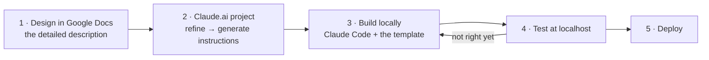

| Step | What you do |
|---|---|
| **1. Design in Google Docs** | Write a detailed project description: what it does, who uses it, what integrations it needs, what the screens look like. **The more detail, the better Claude builds.** This doc is the source of truth. |
| **2. Create a project on Claude.ai** | Upload the design doc and any reference files. Chat to refine the design, then ask it to **"create instructions for Claude Code"** — it produces a set of files to download. |
| **3. Build locally** | Download those files into `Design/`. Copy the project template. Create the GitHub repo. Open VS Code, start Claude Code, and say: *"Read all files in the Design folder and build the project as described."* |

> **Naming rule:** always `orcanos-[addon]-[name]` — lowercase letters and hyphens only.
> **The GitHub repo, the local folder and the Claude project all share the same name.**

### 15.3 Bootstrapping a new project

| # | Step |
|---|---|
| 1 | **Create the folder**, named exactly like the project |
| 2 | **Copy the project template** — [`github.com/zoharp/new-project`](https://github.com/zoharp/new-project). It ships `CLAUDE.md`, `SYSTEM.md`, the folder skeleton, `run_claude.bat` / `run.bat` / `deploy.bat`, `.env.example`, `.gitignore` |
| 3 | **Put the generated design files in `Design/`** |
| 4 | **Create the GitHub repo**, same name, push the template |
| 5 | **Copy the skills library** — clone [`github.com/zoharp/claude-skills`](https://github.com/zoharp/claude-skills) and copy the folders you need into `%USERPROFILE%\.claude\skills\`. Claude picks them up automatically ([chapter 16](#16-skills--what-they-are-where-they-live-how-to-use-them)) |
| 6 | **Open VS Code and start Claude Code** in the project folder |

Installing Claude Code itself:

```bash
# macOS / Linux
curl -fsSL https://claude.ai/install.sh | bash
# Windows (PowerShell)
irm https://claude.ai/install.ps1 | iex
```

The tools, one sentence each: **Claude.ai** (web/mobile — strategy, design phase),
**Claude Code** (terminal — the main build tool), **the VS Code extension** (both modes
without leaving your files), **Claude Desktop** (quick questions outside a project folder),
**Cowork** (recurring background automation).

### 15.4 The session loop — every session, same five steps

| # | Step |
|---|---|
| 1 | **Open Claude in the project folder** |
| 2 | **Read the context files first** — *"Read CLAUDE.md and SYSTEM.md so you understand the project."* One line, full project awareness |
| 3 | **One specific task.** Name the file. Describe the **outcome**, not the steps |
| 4 | **Review the proposal before approving.** Right file? Makes sense? **Never approve changes to files you did not ask about** |
| 5 | **Test, then commit, then move on.** Verify in the browser. Commit. **Never chain unverified steps** |

**When Claude is stuck in a loop** — the signs are: the same error after two or more
attempted fixes, Claude editing files you did not ask about, or you have typed *yes* more
than three times on the same problem. The reset sequence:

1. **"Stop. Let us step back."** — interrupt the current plan entirely.
2. **"Explain the problem before fixing it."** — force diagnosis first. This is what
   exposes the wrong assumption causing the loop.
3. Give a tighter instruction. Still stuck? `git checkout` to roll back and try a
   different approach.

### 15.5 Prompting — describe the outcome, not the steps

This is the single biggest lever on output quality.

| | |
|---|---|
| ❌ **Weak** | *"Add a useState hook and a useEffect that fetches from /api/users when the component mounts."* You are doing all the thinking; Claude is just typing. You get exactly what you described — even if it is the wrong approach for this codebase. |
| ✅ **Strong** | *"When the Users page loads, fetch the user list from the Orcanos API and show it in a table. If the fetch fails, show a retry button. Match the style of the existing tables in the app."* Claude knows the outcome, handles the edge cases, matches existing patterns. |

Every good prompt has four things: **which file** (name it explicitly, every time), **the
outcome**, **a reference** (*"match the existing card style"*), and **the edge cases**
(loading, error, empty).

Two more habits: **upload real content instead of describing it** — screenshots of errors,
the existing UI, a design file; and **when the result is wrong, be surgical** — *"the error
message shows in the wrong place"* beats rewriting the whole prompt.

### 15.6 Build locally, push only when it works

**Never build and test on the live environment.** Run the full stack on your machine and
treat it as the proving ground: start locally → let Claude build one step → verify at
localhost → commit → and only push when every step has passed.

Three git commands that make this safe:

```bash
git diff                       # see what Claude changed
git checkout src/MyFile.jsx    # undo changes to one file
git reset HEAD~1               # undo the last commit, keep the files
```

> **Nothing Claude does is permanent.** Git gives you a save point at every step, so let
> Claude try things freely — rolling back is one command.

### 15.7 Essential commands

| Command | What it does |
|---|---|
| `/init` | Analyses the project and creates a `CLAUDE.md` |
| `/plan` | Claude researches and writes a plan **without touching any files** |
| `/context` | Shows what is in the context window and how much space each part takes — **system prompt** (built-in instructions), **system tools** (file/bash access), **memory files** (`CLAUDE.md`, `SYSTEM.md`, `~/.claude/`), **conversation** (this session). Use it to diagnose "why is Claude forgetting things" |
| `/compact` | Summarises the conversation into a tight digest. **Run it at 15–20 % context usage, not when you are nearly full** — compacting when full loses more detail |
| `/clear` | Clears history and starts clean. Use when switching tasks |
| `/model` | Switch model mid-session ([§12.5](#125-which-model-a-developer-should-use)) |
| `claude -c` | Resume the last session — context and history continue |
| `Ctrl+C` | Stop immediately if Claude starts doing something unexpected |
| `exit` / `Ctrl+D` | Close the session |

### 15.8 Context files — CLAUDE.md and SYSTEM.md

Claude forgets everything between sessions. These two files are what fix that.

| | **`CLAUDE.md`** — *how it is built* | **`SYSTEM.md`** — *what it does* |
|---|---|---|
| Holds | Tech stack, platform choice, key file paths, the reference to `~/.claude/skills`, the Orcanos API base URL and auth pattern, how to run the dev server | What each page or feature does, how data flows, the Orcanos integrations and their purpose, business logic and access rules |

Chapter 17 goes deeper on how we keep `CLAUDE.md` small and what belongs one link away.

### 15.9 Claude.ai — projects and memory

Claude.ai is where non-technical team members work, and **projects** plus **memory** make
it far more useful than a fresh chat every time.

* **A project groups related conversations** and carries shared context automatically. Dev
  team: add `CLAUDE.md` and `SYSTEM.md` as project context. Design phase: upload the Google
  Doc. QA: add the test plans and Orcanos API docs once.
* **Memory** remembers things across conversations. Review what it has stored
  periodically and delete anything outdated or wrong.

> **Orcanos practice:** one project per addon, design doc pinned at the top. Use the web
> project for design and planning, then switch to local Claude Code to build.

### 15.10 External tools and MCP

| Tool | What it gives us |
|---|---|
| **MCP** (Model Context Protocol) | Connects Claude to GitHub, Slack, Google Drive, databases — read tickets, create tasks, search files without switching context |
| **GitHub integration** | Commit from the terminal; with the GitHub MCP, read issues, open PRs and check CI without leaving it |
| **NotebookLM** | Many sources in, one understanding out — build a knowledge base from documents and bring the output into Claude |
| **Firecrawl** | Turns any public URL into clean text Claude can reason about |

### 15.11 Keys — the one rule

**API keys live in `.env` on the backend server, and nowhere else.** The browser is public:
anything in frontend code is visible to anyone who opens developer tools. `.env` is in
`.gitignore`, always.

> ⚠️ **Never paste a key into a chat, an email or Slack — even privately.** If you do,
> treat it as compromised and rotate it immediately at
> `console.anthropic.com/settings/keys`. Full platform rules in
> [chapter 13](#13-security--how-we-work).

### 15.12 The deck itself

The team deck lives at
`C:\Users\zohar\OneDrive\Documents\Claude\Projects\Claude Infrastructure\orcanos-claude-guide.html`
— a single self-contained HTML file, no build step. Its own `CLAUDE.md` carries the rules
for editing it: bump the version in **two** places (the `<title>` and the badge), keep every
`<div>` balanced (an unclosed one silently swallows every following slide), and reorder
slides with a script rather than by hand.

⚠️ **It is due an update.** `change_Instructions.md` beside it lists pending edits, and its
model table predates the Claude 5 family — see [§12.5](#125-which-model-a-developer-should-use).

---

## 16. Skills — what they are, where they live, how to use them

### 16.1 Two completely different things are called "skills"

> ⚠️ **Do not confuse them.**

| | **Claude Code skills** | **Ask Paul persona skills** |
|---|---|---|
| What | Instructions that teach Claude how we work | A product feature — the expert persona Ask Paul answers as |
| Format | A folder with a `SKILL.md` (YAML frontmatter + Markdown) | A `.json` file |
| Where | `~/.claude/skills/`, or a repo's `.claude/skills/` | `Orcanos QMS/skills/*.json` |
| Examples | `orcanos-api`, `ui-ux`, `release-management` | `iso-13485-internal-auditor`, `risk-management-expert`, `iec-62304-software-engineer` |
| Audience | Developers | Customers |

The rest of this chapter is about the first kind.

### 16.2 Where they live

| Location | Scope | Contents |
|---|---|---|
| `C:\Users\<you>\.claude\skills\` | **Global** — every project | 24 skills: `orcanos-api`, `Orcanos-infra`, `orcanos-processes`, `orcanos-login`, `orcanos-form-builder`, `orcanos-test-automation`, `orcanos-rag-architecture`, `supabase-patterns`, `ui-ux`, `gcp-deployment`, `deploy`, `fastapi-streaming`, `release-management`, `req-create`/`req-trace`/`req-gap-check`/`req-status`, `code-review`, `spec-review`, `implementation-plan-review`, `compliance-audit`, `sqlserver-dba`, `new-project`, `markdown-to-docx` |
| `traceability-matrix\.claude\skills\` | That repo only | `gitbook`, `landing-page`, `tutorial-video`, `security-scan`, `multitenant-audit` |
| `Orcanos QMS\.claude\skills\` | That repo only | `gitbook`, `document` |
| `c:\AI Projects\Claude-skills\` | **The source repo** | The library, with `install.bat` / `install.sh` and project templates |

### 16.3 Using a skill

Type `/skill-name` in Claude Code, e.g. `/release-management`, `/gitbook releases`,
`/security-scan diff`. Many also auto-invoke: each skill's `description` frontmatter is the
trigger, so asking "review this spec" pulls in `spec-review` without being told.

### 16.4 Adding or changing a skill

```
1. Create  Claude-skills/skills/my-skill/SKILL.md
2. Frontmatter:  name, description (the trigger — be specific and action-oriented), revision
3. Install:  install.bat            (all)   or   install.bat my-skill   (one)
             → copies into %USERPROFILE%\.claude\skills\
4. /reload-plugins in Claude Code
5. Commit and push the Claude-skills repo
```

Project-specific knowledge belongs in the **project's** `.claude/skills/`. Only things that
are true everywhere go global.

### 16.5 The Orcanos API skills

`orcanos-api` is the **router**. Start there; it points at one skill per endpoint —
`qw-login.md`, `qw-get-filter-results.md`, `QW_Add_Object`, `QW_Add_Relations_Custom_Code`,
`QW_Get_Object`, `QW_Get_Object_Relations`, `QW_Get_Item_Add_Edit`, and the Ask Paul AI
endpoints. It documents Ask Paul's `backend/api.py` as the reference proxy implementation.

Three companions:

* **`Orcanos-infra`** — *what* an Orcanos object is: work items, item types, modules,
  processes. The conceptual model.
* **`orcanos-processes`** — how QMS processes actually run: training, document control,
  CAPA. Triggers, states, roles, who signs what.
* **`orcanos-form-builder`** — builds a real Add/Edit screen for any item type from a live
  `QW_Get_Item_Add_Edit` response.

Rule of thumb: **`Orcanos-infra` for what, `orcanos-api` for how, `orcanos-processes` for
when and by whom.**

---

## 17. CLAUDE.md and MD files

### 17.1 What CLAUDE.md is

`CLAUDE.md` in a repo root is **loaded into every Claude Code session in that project**. It
is the standing brief: architecture summary, the traps, the conventions, what not to do.

Because it is always loaded, it is **capped and precious**. Two real numbers from our own
repos:

* Traceability's `CLAUDE.md` was **145 KB** — the trap notes alone were 99 KB. Split out to
  `docs/notes/`, it is now ~21 KB.
* Before that, the changelog inside it was **313,000 characters — 76 % of the file**, about
  100k tokens loaded into every session whether relevant or not.

**The pattern that came out of this, and that we now follow everywhere:**

| Put in `CLAUDE.md` | Put one link away |
|---|---|
| Current version numbers | Release history / changelog |
| A docs map — what to read when | The deep documents themselves |
| The traps: things that fail **silently** | Long explanations of each trap |
| Conventions and hard rules | API listings, file inventories |
| What NOT to do | User manuals, design specs |

> **The test for a `CLAUDE.md` line:** would getting this wrong produce a *clean, plausible,
> wrong* result? If yes, it belongs there. If it is history or reference, link to it.

### 17.2 Our MD file conventions

| File | Purpose |
|---|---|
| `CLAUDE.md` | Always loaded. The brief. |
| `README.md` | Human-facing: what it is, how to set it up |
| `ARCHITECTURE.md` | The design in depth, and *why* each decision |
| `SCHEMA.md` | Every table and column, with DDL and ownership |
| `SECURITY.md` / `SECURITY_AUDIT.md` | The security contract, and the findings ledger |
| `DEPLOYMENT.md` / `INSTALL.md` | How to deploy; how a customer installs |
| `TESTING.md` | The test plan, and **what has genuinely been verified** |
| `docs/notes/` | Numbered traps, grouped by area, **globally and stably numbered** |
| `docs/API.md`, `docs/FILE_MAP.md` | Route list; file inventory |
| `design/` | Intent written *before* the build. **Never updated after — it drifts.** For what the code does today, read the other files. |
| `user-manual/USER_MANUAL.md` | End-user help, published to GitBook |

Two habits worth copying:

* **Stable numbering.** `See Critical Note #19` resolves through an index, so notes can move
  between files without breaking a single reference in the code.
* **Say what is verified and what is not.** Traceability and Account Management both keep an
  explicit ✅/⬜ table. "Untested" written down is worth more than a confident paragraph.

---

## 18. GitHub and our CI/CD

### 18.1 Repos

All private, all under `zoharp/`, all on `main`, all cloned under `c:\AI Projects\`:
`orcanos_qms_AI`, `traceability-matrix`, `account-management`, `covaris_bom`,
`quiz-management`, `ai-portal`, `Claude-skills`.

### 18.2 ⚠️ The deployment gate

> **Commit locally. Do not `git push`, deploy, or trigger Cloud Build without explicit
> approval.**

On Vercel-backed repos **a push to `main` is a production deploy**. This gate is not
overridden by the "don't ask for permission on routine work" rule.

### 18.3 The release ritual — every shippable change

1. **Bump the version** — `package.json` (or the equivalent) *and* the version block at the
   top of `CLAUDE.md`.
2. **Prepend to `release_notes.json`** — the short list the app's own release-notes modal
   shows. ⚠️ **Never put customer data or account names in it — it ships to the browser
   verbatim.**
3. **Prepend the long form** to `docs/changelog/CHANGELOG-vN.md`, and add its one-line row
   to `docs/changelog/README.md`.
4. **Sync GitBook** — `/gitbook releases`.
5. **Requirements traceability** (Ask Paul, after a deploy touching source) — `/req-trace`
   on modified files, `/req-create` for new behaviour. Skip pure style/config changes.

The `/release-management` skill does steps 1–3.

### 18.4 The deploy scripts — Traceability is our best practice

`deploy.bat` is a **six-step gated publish**. This is the model to copy:

| Step | What | Why it is a gate |
|---|---|---|
| 1 | Mirror `release_notes.json` into `src/frontend/public/`, then **binary-compare the copy** | The app reads the *copy* at runtime. Skip this and the footer shows the previous version through any number of clean deploys, with nothing failing. **This has drifted twice.** |
| 2 | Rebuild the landing page (`python landing/landing.py build`) | The public page ships the newest version number |
| 3 | `git add -A`, show status, prompt for a message, commit, push | One place, one confirmation |
| 4 | `flyctl deploy` | The actual deploy |
| 5 | Build the IIS zip (`build_and_zip.ps1`) | The on-premises package never drifts from the cloud one |
| 6 | `curl` the live landing page and print HTTP status + byte size | **Proof it is actually live** |

**Any step failing stops everything.** Nothing half-deploys.

Ask Paul's `deploy.bat` follows the same idea for Cloud Build: commit → push → then run
`git_scripts/verify_deploy.py`, because *a push alone does not mean deployed*. If the build
fails you are told that production is still running old code.

Account Management's `deploy.bat`: **typecheck → `next build` → commit prompt → push**. The
build gate runs **before** the commit prompt, so a broken build never reaches a red Vercel
deploy. Pushing requires typing `DEPLOY`.

### 18.5 The dev scripts

`run_dev.bat` in each project. What Traceability's does, and why each part exists:

* Uses **ports 8010 / 3010**, deliberately not 8000/3000, because Ask Paul and
  quiz-management use those and would collide.
* Kills **only what holds those ports** — a blanket `taskkill /IM python.exe` would kill the
  Ask Paul backend too.
* **Verifies the port actually freed.** `taskkill` cannot kill a process from another
  session but still reports success-ish; the old backend then keeps serving and your code
  changes appear to do nothing. This cost hours on 2026-08-29.
* Uses `ping` instead of `timeout` to sleep — `timeout` dies with *"Input redirection is not
  supported"* whenever stdin is redirected.

Account Management's frees port 3100, creates and opens `.env.local` if missing (and stops,
because the app cannot start without it), installs dependencies on first run, and runs the
dev server in the **foreground** so Ctrl+C works.

> **Critical Note #32, and it applies to every project:** *"my code change had no effect"* is
> usually a **stale process holding the port**, not a code problem.

### 18.6 The documentation pipeline

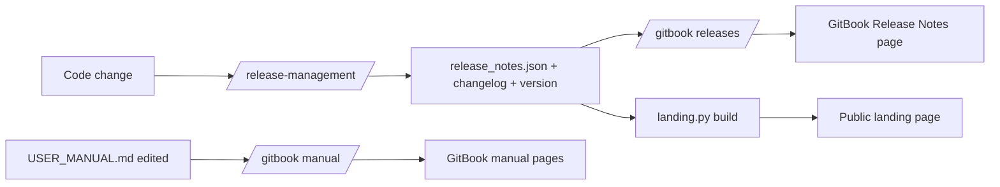

**GitBook.** One page per `##` H2 section of `USER_MANUAL.md`, plus an auto-generated
Release Notes page placed last.

* Spaces: Traceability `DX08MS01eLeTOrEp4kod` → https://orcanos.gitbook.io/traceability-marix/ ·
  Ask Paul `Ywj8Iox1ZDfgLDr6wn6r` → https://orcanos.gitbook.io/orcanos-qms-ai/ ·
  org `1DKN3pu6aPQvXpFb3qPY`.
* The **token is never in source control** — `GITBOOK_TOKEN` in `.env.local` or the
  environment.
* Pages are matched **by title**, so existing pages are *updated* and keep their URL and
  history. Content hashes are cached, so unchanged pages are skipped.
* Always run `--validate-only` first, then upload.
* ⚠️ **Renaming an H2 looks like delete + create** and loses that page's GitBook history.
  Rename in the GitBook UI first, then in the markdown.
* The app's `?` help icon reads its URL from `src/frontend/public/app-settings.json` →
  `helpUrl`, so it can be repointed **without a rebuild**. Empty string hides the icon.

**Landing page.** `landing/landing.py build` renders `index.template.html` +
`landing.config.json` + `landing/shots/*.png` into one self-contained HTML file (fonts and
images inlined — that is why it is ~700 KB, which step 6 of the deploy verifies).

**Help video.** `tutorial-video/` — a storyboard JSON plus `render.py` produces narrated
MP4s, catalogued in `CATALOG.json` / `catalog.html`. Skill: `/tutorial-video`.

**Requirements evidence.** Ask Paul's `scripts/compliance/generate_docs.py` pipeline
produces IEC 62304 evidence into `/docs/`. **Keep it separate from the GitBook user manual
— never point them at the same space.**

---

## 19. Installing Traceability on IIS

For customers who want it on their own Windows Server. Full detail in
`traceability-matrix/INSTALL.md`.

### 19.1 The shape of it

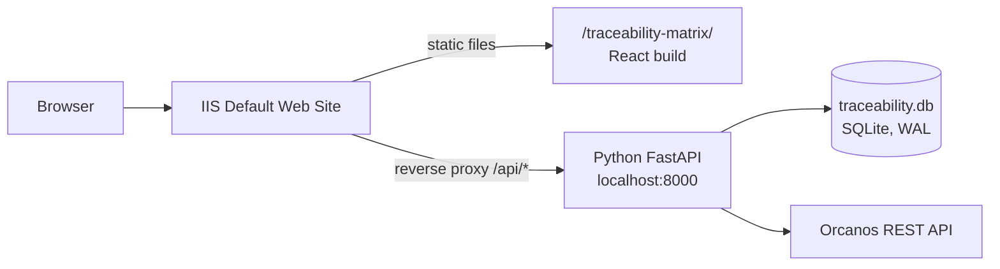

### 19.2 Steps

| # | Step |
|---|---|
| 1 | **Enable IIS** — Settings → Apps → Optional Features → More Windows features → Internet Information Services (include Application Development Features). Check `http://localhost`. |
| 2 | **Install URL Rewrite** — https://www.iis.net/downloads/microsoft/url-rewrite |
| 3 | **Install ARR** (Application Request Routing) — https://www.iis.net/downloads/microsoft/application-request-routing |
| 4 | **Enable the reverse proxy** — IIS Manager → server node → Application Request Routing Cache → Server Proxy Settings → tick **Enable proxy** → Apply |
| 5 | **Copy files** — extract `traceability-deploy.zip` into `C:\inetpub\wwwroot\traceability-matrix\` |
| 6 | **Copy `wwwroot_web.config`** to `C:\inetpub\wwwroot\web.config` — this is what proxies `/api/*` to the backend |
| 7 | **Configure `.env`** — `ORCANOS_BASE_URL`, `ORCANOS_TENANT`, `DATABASE_PATH`, `SECRET_KEY`, `SESSION_TIMEOUT`, `ADMIN_PASSWORD` |
| 8 | **Run the backend** on `localhost:8000` — manually, or as a Windows Service |
| 9 | **Open** `http://<server>/traceability-matrix/` |

The build package comes from `build_and_zip.bat`, which builds React with
`PUBLIC_URL=/traceability-matrix`. `src/frontend/public/web.config` handles SPA routing and
is included in the build automatically.

### 19.3 ⚠️ Upgrading an existing install

The customer's saved panels live in
`C:\inetpub\wwwroot\traceability-matrix\backend\traceability.db`.

1. **Stop the backend first.** WAL mode means the newest writes may still be in
   `traceability.db-wal`. A clean shutdown folds them in.
2. **Back the database up.** If the process was killed and a `-wal` file exists, copy
   `traceability.db-wal` and `traceability.db-shm` **with** the `.db`.
3. Copy the new files over. **The deployment zip no longer contains a database**, so the
   existing one is left untouched — but keep the backup anyway.

> **Critical Note #9: never ship the database inside a deploy package.** That is a
> data-loss bug, and it is why the zip no longer contains one.

### 19.4 `/admin` on IIS

`GET /admin` is a FastAPI route, so on Fly it just works at `https://<host>/admin`. On a
reverse-proxied IIS install IIS forwards only `/api/*` to the backend, and the React SPA has
no `/admin` route — so the user lands on the login screen. **On IIS, reach it on the server
itself at `http://localhost:8000/admin`.**

`ADMIN_PASSWORD` is read **at process start**. Change it without restarting and the old one
stays live while the login answers 401.

---

## 20. User manual — Account Management (admin)

Who this is for: Orcanos staff. Everyone else gets a **404** on every route, by design.

### 20.1 Signing in

Go to https://accounts.orcanos.ai. You will see whichever methods the platform account has
enabled: **Google**, **Office 365**, or **Orcanos email**.

To get in at all you need **both**: `role = 'admin'` on your master `users` row, **and** an
`@orcanos.com` email.

For Orcanos email sign-in you also need `orcanos_user_name` set on your `users` row. It is
set by an admin, directly in the database — there is no self-service screen for it yet. The
first field accepts either that username or your email; **`QW_Login` is always called with
the stored username, never with what you typed.**

> If sign-in fails, the screen says only *Invalid credentials*. **Read `security_audit_log`
> for the real reason.**

### 20.2 The Accounts list

Every tenant, one row each: name, status, database, **data region**, module licences, and
spend. Module columns come live from the Traceability instance — a **dash means "no answer
from that source"**, which is not the same as "off".

The **region column is read from the instance that actually holds the data**, not from what
was recorded on the account row. When the two disagree the row is flagged as a **conflict**,
because one of them is wrong and nothing in the console can tell which. Investigate a
conflict before touching anything else about that account.

Since 0.6.0 clicking the account name opens **one window with six tabs** — Overview, Orcanos,
**Traceability**, **Ask Paul**, **LLM**, **Spend** — one per *system* rather than one per
*table*. The two AI configurations sit together on the LLM tab, and both cost ledgers sit on
Spend, listed separately rather than summed: one is a lifetime counter, the other a total over
the events shown, so a combined figure would mean nothing.

### 20.3 Creating an account

1. Click **Create account**.
2. Fill in the name and the Orcanos API URL. **The Orcanos tenant is parsed out of that
   URL** — the form shows you which tenant it decided on. With no URL there is no tenant,
   and the Traceability/Training licence pills stay disabled.
3. Choose modules. Since 0.3.3, **every account creation writes the Traceability
   `account_access` row**, even with nothing ticked — without that row the tenant cannot sign
   in to Traceability at all.
4. **Choose the Data Region — United States or European Union.** Since 0.4.0 this is
   **required and has no pre-selected value**, and the form says the choice cannot be changed
   afterwards. It decides which Supabase region the customer's own database is created in and
   which Traceability instance holds their data. Creating an **EU** account is **refused**
   while no EU Traceability instance is configured — it would write the tenant's data to the
   US while recording it as EU, and nothing anywhere would report the contradiction.
5. A database is optional since 0.3.0. **An account created without one is created
   inactive.**

The new account is **signposted in every region**, best-effort, so a customer who opens the
wrong region's address is redirected to their own instead of being told the account does not
exist. If a region cannot be reached the account is still created and the console says which
one to retry.

### 20.4 Editing an account

| Field | Notes |
|---|---|
| Passwords / keys | **A blank field means "keep the stored secret."** Sending an empty string would wipe a working credential. |
| Vector DB key | **Cannot be saved until it tests green.** Editing any vector field clears the previous test result — a green tick from the old value must not authorise a new one. |
| Connection tests | Three states. Green, red, and **neutral `{success: null}` = "nothing configured to test"**, which is not a failure. |
| Status switch | Writes `is_active` — and because Ask Paul depends on it, it is an Ask Paul control despite its label. |
| **Data region** | **Read-only.** It is fixed when the account is created, so it is displayed as a fact rather than offered as a field, and `PATCH` refuses a change. Rewriting it would move no data — it would only record the customer as living somewhere they do not, while the console asserts a residency guarantee that is false. To actually move them, use the region move (§20.8). |

Test buttons: **Orcanos DB**, **Vector DB**, **Orcanos login**. The login test pins the URL
to the account's own saved one whenever it falls back to the stored password — a decrypted
secret must never be sent to a host someone typed.

### 20.5 Module licences

| Module | Rule |
|---|---|
| **Traceability / Training** | Licensing either one on a tenant without an `account_access` row creates the row. A new row is licensed for **nothing**, explicitly. |
| **Ask Paul** | **Cannot be turned ON without a database** (`vector_db_host` or `db_host`) — it is the only module with a per-tenant vector store. Turning it **off is never blocked**. |

Because of the provisioning limitation, **Ask Paul currently cannot be licensed at creation
time.** Create the account, add the database under *Edit → Vector DB*, then use the pill.

### 20.6 Provisioning a database

A **resumable job**, not a single long request: `creating_project → waiting_healthy →
fetching_keys → running_schema → saving_account → done` (or `error`). The browser polls
every 4 seconds, so a timeout, a redeploy or a closed browser costs one step, not the job.

⚠️ **`running_schema` cannot work from Vercel today** — see [§3.2](#32-the-differences-that-actually-bite).
Consequences you must know before running it:

* The first real run left an **orphan**: project `klrgfaddrnnawvagomxr` (`qms-pcure`) was
  created and billable, then the job died a step later.
* **Retrying makes it worse** — the second attempt fails at creation with *"Project with
  name … already exists"*, so you end up with an orphan **and** no account.
* The orphan-finder query is at the bottom of `sql/001_account_provisioning.sql`. **Run it
  after any failed run.**

### 20.7 Deleting an account

⚠️ **Delete does not de-provision the tenant's Supabase project.** That project keeps
costing money until someone removes it by hand. The warning is shown on screen — read it.

Since 0.5.0 delete requires typing **DELETE** — the old confirmation was a single click, one
row away from a module toggle. Since 0.6.0 it lives on the **Ask Paul** tab, where it says
what it destroys: the master account record, its database credentials, its key and its
sign-in methods. **It never touches the traceability tenant** — a distinction the old
Danger zone did not draw.

### 20.8 Moving an account to another region

This happens once in an account's life, if ever, so it sits behind a button on the account
screen rather than on the first tab you land on.

1. The **seven steps appear as soon as the confirmation is typed**, so the plan is readable
   *before* the move is authorised: freeze → export → import → compare row counts → restore
   access → update master and the directory → purge.
2. Each step is ticked off as the server passes it, with the row counts it actually moved.
   There is no percentage bar — the export, import and purge are each a single call to a
   regional instance that reports no fraction.
3. Confirm by typing the **tenant name**.

What to tell the customer beforehand:

* **Everyone signed in gets signed out.** Sessions do not travel — they hold the Orcanos
  credential under a key that is deliberately different per region.
* **Their Ask Paul vector database does not move**, because a Supabase project cannot be
  relocated between regions.
* **Their training snapshots and quiz records do move** — those are the evidence behind
  records they have already signed off, so they are not disposable.
* **The source copy is deleted only after both sides' row counts match.** If anything arrives
  short, the move stops and nothing is deleted.

⚠️ **After a move into a region, check that region's secrets before believing a bug report.**
A feature written to fail closed disappears in a region that never had its secret set, and it
looks exactly like a failed move — see §5.8.

### 20.9 The Audit page

Every security-relevant event from **both** apps: sign-ins with method, tenant and outcome
reason; account changes; licence changes.

Two things to expect: it **starts on 2026-08-29** — nothing before that was ever recorded —
and the account filter shows **both old and new spellings** of renamed accounts, because
audit rows deliberately keep the label the event actually carried at the time.

---

## 21. Future: stay on Vercel/Fly, or move everything to Orcanos AWS?

### 21.1 The guiding position

> **Hosting is the axis that matters least, and consolidating it should come last.**
> Three hosts is untidy, but it is not what blocks a single login, and unifying them is
> weeks of work with no customer-visible benefit.

What *is* load-bearing is the **domain**, not the host. An httpOnly session cookie spans
any set of hosts that share a registrable parent domain. Put every app on a subdomain of one
parent — `qms.`, `trace.`, `bom.`, `portal.` — with the session cookie scoped to the parent,
and Vercel, Cloud Run and Fly can keep serving exactly what they serve today **while sharing
one session**.

**Domain unification buys SSO. Host unification buys tidiness. Do the first; defer the second.**

### 21.2 Option A — stay where we are

| Pros | Cons |
|---|---|
| Zero migration risk; customers see nothing | Three consoles, three secret stores, three deploy models |
| Each host is genuinely good at its job | Three bills, and no single view of cost |
| Push-to-deploy already works everywhere | Skills and knowledge split three ways |
| Managed SSL, CDN, backups included | Data sits with three vendors — more sub-processor questions in an ISO 27001 review |

### 21.3 Option B — move everything to Orcanos AWS

| Pros | Cons |
|---|---|
| **One vendor, one bill, one security boundary** | We rebuild what Vercel/Fly/Supabase give free: CI, SSL, CDN, backups, preview deploys |
| Much easier ISO 27001 / data-residency story | We become responsible for patching and uptime |
| The **Bedrock gateway is already on Orcanos AWS** — LLM traffic stops leaving | pgvector on RDS must be set up and tuned by us |
| Customer data never leaves Orcanos infrastructure | Weeks of work, **zero new features** |
| Simpler network path to customer SQL Servers | New failure modes we have no experience with |

### 21.4 Recommendation

**A hybrid, in this order:**

1. **Now — one parent domain.** Cheap, low risk, unlocks SSO. Do it regardless of everything
   else.
2. **Now — LLM traffic to the Orcanos Bedrock gateway** where it makes sense. It already
   works, it is already AWS, and it removes a sub-processor from the conversation.
3. **Later — consolidate the two Python backends onto *one* container host.** Fly **or**
   Cloud Run, not both. Neither is better on merit; decide by where CI and secrets already
   live. ⚠️ Any move must preserve Fly's `min_machines_running = 1`, which exists because
   Traceability runs multi-minute builds on background threads with no HTTP request holding
   the machine up, and Litestream only replicates from a running process.
4. **Only if a customer or an audit demands it — move the data to AWS.** That is the
   expensive half.

**Keep Vercel for the Next.js control plane and the static frontends either way.** There is
no scenario where hand-rolling that on AWS is a good use of our time.

### 21.5 Moving Ask Paul to Orcanos AWS specifically

The interesting part is the vector store: **AWS RDS Postgres + pgvector instead of a
Supabase project per tenant.**

**What we would lose, and must rebuild:**

| Supabase gives us | On RDS we would build |
|---|---|
| **Create a project by API** (`POST /v1/projects`) — the whole one-click provisioning flow | A schema or database per tenant, created by our own migration runner. *Simpler, actually* — no external project lifecycle |
| **PostgREST** — a REST API over the tables for free | Our backend already queries through one layer (`supabase_client.py`); it would talk SQL instead. Real work, but bounded |
| Managed backups, PITR, dashboard | RDS gives all of this natively |
| A service-role key per project as the isolation boundary | A Postgres role per tenant, or RLS — a **stronger** boundary, but one we own |

**What gets better:**

* **No per-tenant project bill, and no orphaned-project problem.** [§11.5](#115-the-non-llm-costs-which-are-the-ones-that-surprise-us)
  goes away entirely.
* **The provisioning state machine gets much simpler** — no waiting for a project to become
  `ACTIVE_HEALTHY`, no `readServiceKey()` guessing at response shapes.
* **The IPv4/IPv6 problem disappears.** RDS is reachable normally.
* One database engine to tune, one connection pool, one backup policy.

**The two decisions to make first:**

1. **Schema-per-tenant, database-per-tenant, or one database with RLS?** Schema-per-tenant
   is the closest match to today's isolation model and the easiest migration. RLS is the
   cheapest to run and the easiest to get subtly wrong.
2. **Do the embeddings survive the move, or are they regenerated?** Copying pgvector data
   between Postgres instances is straightforward; regenerating costs real money at
   per-tenant scale. Copy them.

**Suggested sequence:** stand up RDS with pgvector → move **one** small tenant → run both in
parallel and compare answers → move the rest → decommission. The master database moves
**last**, or not at all.

---

## 22. Next steps — the short list

### 22.0 Residency — the list that moved to the top on 2026-09-10

These come before everything below, because we now have EU customers on a guarantee that is
**partly** true, and each unfinished row is a compliance claim we cannot make yet (§5.7).

| # | Step | Why now | Risk |
|---|---|---|---|
| R1 | **Verify the EU Litestream bucket is EU-region-restricted** | Tigris distributes globally by default. An unrestricted bucket puts the EU database's write-ahead log on US edges and **nothing in the app can detect it** | None to do; the current state is the risk |
| R2 | **Write the `zz-gate-closed` sentinel into any new region before announcing its URL**, and make it a step in the region-standup checklist | A fresh region's empty allowlist fails open — the EU app was open to every tenant for minutes | None |
| R3 | **Region-route Traceability's own AI calls** through the per-account engine to a regional Bedrock endpoint | Panel-describe, trace-build and quiz-generation send requirement text and trainee names to the US Anthropic API today. **A US call for an EU tenant returns a perfectly normal answer** | Medium |
| R4 | **Decide the Ask Paul EU story** — an EU Cloud Run service and an EU embedding path, or a stated limitation in the contract | The vector DB is in Frankfurt; the backend, the embeddings and most LLM branches are not. Until this is answered, **do not claim EU residency for Ask Paul** | High |
| R5 | **Only then** set `ASK_PAUL_APP_URL` / `ASK_PAUL_SSO_SECRET` on the EU app | Pointing EU at the US app is a residency breach that looks like a feature working (§5.8) | — |
| R6 | **A secret-parity check that runs on deploy** and reports the difference between the two regions' `fly secrets list` against the decision table in §5.8 | Nothing detects the drift today, and the failure is invisible: same build, no error, one region quietly missing a paid feature | Low |
| R7 | **Make `deploy.bat` deploy both regions, or refuse to finish until the other one is done** | It deploys the US app only. A release is not shipped until both commands have run, and a version drift produces no error anywhere | Low |
| R8 | **Set `ADMIN_PASSWORD` and `SECRET_KEY` on both regions** — different values — and confirm `/admin` is not 503 | v3.44.0 removed the password default. Until they are set, `/admin` is unusable; before it shipped, it was open | None |
| R9 | **Rehearse a region move on a test tenant end to end**, including the sign-out and the Ask Paul caveat | It has run once, in anger. The purge is irreversible and the safety is the row-count comparison | Low |

### 22.1 The rest, ordered by value per unit of risk

| # | Step | Why now | Risk |
|---|---|---|---|
| 1 | **Fix the orphaned Supabase project `qms-pcure`** and run the orphan-finder query | It is billing us today | None |
| 2 | **Fix provisioning to use the Supabase pooler host** (`aws-0-<region>.pooler.supabase.com:5432`, user `postgres.<ref>`), and create the `accounts` row *before* the project | The DDL step cannot work from Vercel; failures are unrecoverable | Low |
| 3 | **Test everything in Account Management that writes.** Only sign-in and the list are verified | We are one save away from finding out the hard way | Low |
| 4 | **Rehearse a restore** — Litestream and Supabase — and write down how long it took | ISO 27001 evidence, and peace of mind | None |
| 5 | **`user_accounts` membership table in master** | Every consolidation step needs it; nothing reads it at first | Low |
| 6 | **One parent domain**, session cookie scoped to it | Unlocks SSO with no app moving anywhere | Low |
| 7 | **Portal shell + module registry**, `modules[]` served from master. Single-module tenants skip the launcher, so nothing changes for them | Proves one login without absorbing any app | Low |
| 8 | **One shared Orcanos API client** instead of three | Highest-value de-duplication we have | Medium |
| 9 | **Orcanos as a fourth auth method** through the same login tail, shipped disabled | Lets Traceability and covaris-bom join without users learning anything | Medium — needs the open decisions answered |
| 10 | **Migrate `ai_usage` → `account_usage_logs`** | Append-only, already duplicated: the safest possible first migration, and it proves the pipe | Low |
| 11 | **Traceability onto the platform session**, per tenant, behind a flag with rollback. Its `sessions` table dies here | First genuinely customer-visible change | **High** |
| 12 | **Config tables to Postgres**, cache stays local | Only now is the shape known | Medium |
| 13 | **Hosting consolidation**, if still wanted | Optional, and possibly never worth it | — |
| 14 | **Add `accounts.orcanos_tenant`** so the tenant stops being parsed out of a URL | Removes a whole class of guessing | Low |
| 15 | **Retention policy + access review schedule + sub-processor list** | The remaining ISO 27001 gaps | None |
| 16 | **Update the team deck and its model table** ([§15.12](#1512-the-deck-itself), [§12.5](#125-which-model-a-developer-should-use)), and work through the pending `change_Instructions.md` edits | It is what new people are onboarded with, and it predates the Claude 5 family | None |
| 17 | **Decide the cost-ledger boundary** — one service keyed on both tenant and application, or two ledgers with a stated line between them — then fix the stale price table before building `orcanos-ai-cost-analysis` ([§11.7](#117-the-centralized-cost-service--designed-not-built)) | A wrong price table writes a wrong ledger silently, and two overlapping ledgers is how numbers stop agreeing | Low |

### The open decisions blocking step 9

* **D1 — the join key.** What links an Orcanos user to a master `users` row? `QW_Login`
  returns a `User_name` that is unique per tenant, not globally. Today we use
  `orcanos_user_name` + `orcanos_account`, unique on the pair — the honest option. Also:
  do we JIT-provision a user on first `QW_Login`, or not?
* **D2 — who do we call Orcanos as?** Traceability calls **as the end user** (per-session
  Basic header); Ask Paul uses **one account-level credential**. These are different
  authorisation models, and switching changes what Orcanos records in its own audit trail —
  which matters for a regulated QMS. A stateless JWT has nowhere safe to hold a per-user
  Basic header, so answering "per user" means keeping a server-side session row.
* **D3 — is a module licence per tenant or per user?** Recommendation: tenant-level with
  optional per-user narrowing.
* **D4 — does covaris-bom join at all?**
* **CSRF:** Account Management relies on `SameSite=Lax`; Traceability issues an explicit
  `X-CSRF-Token`. Pick one, apply it everywhere.

---

## 23. Glossary

| Term | Meaning |
|---|---|
| **Account / tenant** | One customer. In Orcanos it is the `Virtual_dir` — the path segment in `app.orcanos.com/<tenant>` |
| **ARR** | Application Request Routing — the IIS module that reverse-proxies `/api/*` |
| **Bedrock gateway** | `br.orcanos.com/ext/chat` — an Orcanos-owned proxy in front of AWS Bedrock. Serves Claude *and* OpenAI models |
| **ContextVar** | Python per-request variable. How Ask Paul routes a request to the right customer database |
| **Control plane** | Account Management — the app that manages the other apps' tenants |
| **Data region** | `us` or `eu`. One value per account on `accounts.region` in master, chosen at creation and **immutable** |
| **Regional instance** | One of the two Traceability deployments. Its identity is `SELF_REGION`; two apps sharing one value is undetectable from inside either |
| **`account_region`** | The cross-region directory (tenant → region), held identically everywhere. **Grants nothing** — never consult it in a gate |
| **Hand-off** | The automatic redirect from the wrong region's login screen to the right one, decided from the Orcanos URL alone, **before** the password fields unlock |
| **`rr=1`** | The loop guard on a hand-off URL: *"you have been sent once already"* — stops two regions that disagree from bouncing a browser forever |
| **Region move** | The physical migration of one tenant's rows between regions. Freeze → export → import → compare counts → restore → update → purge |
| **Region conflict** | The console's flag when the recorded region and the instance actually holding the data disagree |
| **Denied sentinel row** | `zz-gate-closed` — closes a fresh region's fail-open allowlist without granting anything |
| **Litestream** | Continuously replicates a SQLite file to object storage. Only works while the process runs |
| **Master Supabase** | The one shared database: identity, tenants, secrets, audit, spend |
| **pgvector** | Postgres extension for vector search — the RAG index |
| **Platform JWT** | The shared HS256 session token, `iss: "orcanos-qms"`, 24 h |
| **PostgREST** | Supabase's automatic REST API over Postgres. Cannot run DDL |
| **QW_Login** | The Orcanos authentication endpoint. Our credential authority |
| **RAG** | Retrieval-Augmented Generation — search the customer's documents, then answer from what was found |
| **Skill** | Either a Claude Code instruction pack, or an Ask Paul persona. [Do not confuse them](#161-two-completely-different-things-are-called-skills) |
| **Smart refresh** | Incremental rebuild reading only rows changed since a watermark |
| **WAL** | SQLite Write-Ahead Log mode. Readers do not block writers — mandatory here |
| **Watermark** | The timestamp a smart refresh reads forward from |

---

## 24. What this document does *not* cover yet

Honest gaps, so nobody assumes coverage we do not have:

1. **Monitoring and alerting.** We have dashboards; we do not have alerts. Nobody is paged
   if Fly stops or Cloud Run starts erroring.
2. **Incident response.** Who is called, in what order, and what we tell customers.
3. **A real cost dashboard.** LLM spend is well tracked; Fly, Vercel, Cloud Run, Supabase
   and Anthropic bills are not tracked together anywhere.
4. **DR / RTO / RPO.** We have replication, no stated targets and no rehearsed restore.
5. **On-boarding and off-boarding a person** across GitHub, GCP, Vercel, Fly, Supabase,
   Anthropic and GitBook.
6. **The customer SQL Server integration** — read-only, but it deserves its own section.
7. **Load and capacity.** One Fly machine, one SQLite writer. We do not know where it breaks.
8. **Formal test evidence for Account Management.** `TESTING.md` says plainly that only
   sign-in and the list are verified. That is honest, and it is also a gap.

---

*Update this file when infrastructure changes. If a chapter contradicts a repo's own
`CLAUDE.md`, the repo wins — and this file needs fixing.*
