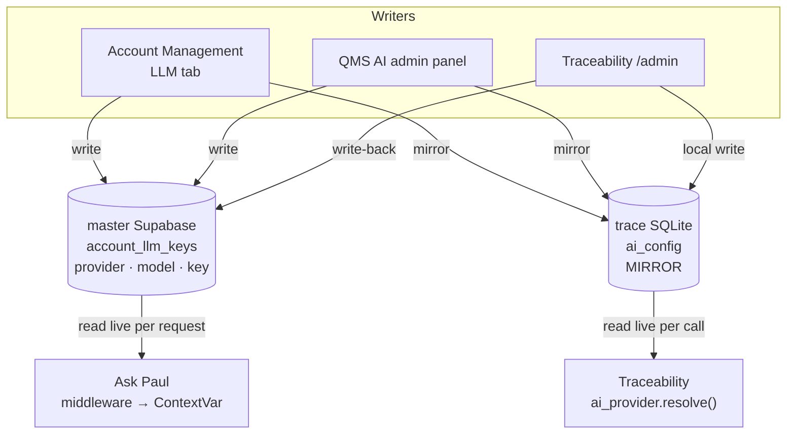

# One LLM per account — proposal

**Nothing in this document is implemented.** It proposes making an account's chat LLM a
single setting that Traceability and Ask Paul both obey, managed from the Account
Management console, with each app's own admin page kept as a co-equal writer.

| | |
|---|---|
| **Status** | Proposal — no code written |
| **Written** | 2026-09-10 |
| **Owner** | Zohar Peretz |
| **Asked for** | "Can we have one LLM per account — both Traceability and Ask Paul the same LLM? Managed in admin, but keep the existing admin in the app to override; each change overrides the other." |
| **Touches** | `account-management`, `traceability-matrix`, `orcanos_qms_AI` (all three repos) |
| **Read first** | [`ORCANOS_AI_INFRASTRUCTURE.md` §12](ORCANOS_AI_INFRASTRUCTURE.md#12-managing-the-llms) — LLM routing as built |
| **Intended destination** | Stays here. It spans all three repos, so no single repo owns it. |

---

## Table of contents

1. [What exists today](#1-what-exists-today)
2. [Why it is not a config change](#2-why-it-is-not-a-config-change)
3. [The proposed shape](#3-the-proposed-shape)
4. [Schema](#4-schema)
5. [The engine → (provider, model) map](#5-the-engine--provider-model-map)
6. [Endpoint contracts](#6-endpoint-contracts)
7. [Region rules](#7-region-rules)
8. [Rollout order](#8-rollout-order)
9. [What NOT to do](#9-what-not-to-do)
10. [Open decisions](#10-open-decisions)

---

## 1. What exists today

Two independent AI configurations that share nothing but the word "AI".

| | Traceability | Ask Paul |
|---|---|---|
| Store | `ai_config` — SQLite, **per-region Fly volume** | `account_llm_keys` — **master Supabase** |
| Keyed on | lowercased Orcanos `Virtual_dir` | `account_name`, case-insensitive |
| Shape | `(provider, model, api_key)` — free-form model string | `engine` enum; **the model is hard-coded in code** |
| Providers | `anthropic`, `bedrock` | `gpt_4o`, `claude_sonnet`, `claude_opus`, `gemini_pro`, `gemini_flash`, `bedrock_claude` |
| Resolution | account row → reserved `'*'` global row → env | account row → env |
| Read | live, per call (`ai_provider.resolve()`) | live, per request (middleware → ContextVar) |
| Key semantics | `None` keep · `''` clear · other set | key is mandatory on every write |
| Admin surface | trace `/admin`, **and already the Account Management LLM tab** | QMS AI's own admin panel only |
| Code | `src/backend/ai_provider.py`, `db.py` (`*_ai_config`) | `backend/account_keys.py`, `api.py` `/admin/accounts/{name}/llm-key` |

The Account Management console already shows both side by side on the **LLM** tab
(`src/components/LlmPanel.tsx`). Traceability's engine is fully editable there; Ask Paul's
key is read-only, with the panel saying so. That component's own header comment states the
reason the tab exists:

> *"seeing both is the only way to notice that a tenant is running Sonnet in one app and
> something else in the other."*

So the console is already the right home. What is missing is that it does not write the
second one.

### 1.1 Ask Paul's model is already split across three stores

This is the part that makes "one LLM" harder than it looks. Ask Paul resolves a call from
**three** places, in two different databases:

| Layer | Where | What it sets |
|---|---|---|
| Account engine | `account_llm_keys.engine` — **master** Supabase | The provider, and by implication a hard-coded model |
| `rag_settings.chat_model` | the **tenant's own** Supabase | The model id, within whatever provider the engine chose |
| Agent definition `engine` / `model` | the **tenant's own** Supabase | A per-agent override of both |

`account_keys.chat_completion_with_usage(messages, model=…, engine=…)` takes the two
independently — the engine picks the branch, `model` overrides the id inside it. So an
account already *can* run `claude_sonnet` with a `chat_model` its admin set to something
else entirely, and nothing reports the disagreement.

**A unified account setting is layer 1 only.** Layers 2 and 3 stay per-tenant overrides and
are out of scope here; §9 says why touching them is a separate decision.

---

## 2. Why it is not a config change

Four obstacles. None is fatal; all of them shape the design.

### 2.1 The vocabularies do not match

`engine` is a closed enum with the model baked into `account_keys.py`
(`claude_sonnet` → `claude-sonnet-4-6`). Traceability stores an arbitrary model string.
The provider sets only partly overlap:

| Provider | Traceability | Ask Paul |
|---|---|---|
| Anthropic direct | ✅ | ✅ |
| Bedrock gateway | ✅ any `modelId`, including `openai.gpt-oss-*` | ⚠️ only, hard-coded, `eu.anthropic.claude-sonnet-4-6` |
| OpenAI direct | ❌ | ✅ |
| Google Gemini | ❌ | ✅ |

A shared row therefore has to be `(provider, model, key)` — the traceability shape — and
**Ask Paul has to stop routing on the enum and route on provider + model instead**.
Mapping the enum forward is lossless (§5). Mapping an arbitrary model *back* to an enum is
not: there is no `engine` value that means "Bedrock running `openai.gpt-oss-120b-1:0`".

### 2.2 Ask Paul needs an OpenAI key even when the account runs Claude

Embeddings are **always** OpenAI on the platform key — `ORCANOS_AI_INFRASTRUCTURE.md` §5.7
records this as an open residency gap, and it is also what stops the key being unified.

> ⚠️ **Embeddings cannot follow the chat engine.** Every chunk in a tenant's `doc_chunks`
> was embedded with one specific model. Change the embedding model and the stored vectors
> and the query vector are no longer in the same space: search still runs, still returns
> rows, and the similarity scores are quietly meaningless. The failure mode is *worse
> answers*, not an error.

**"One LLM per account" means one *chat* LLM.** The embedding key and model stay separate
and stay platform-level. Write this on the screen, not just in this document — otherwise
the next person to read "one LLM per account" will unify it.

### 2.3 Traceability cannot read master

There is **no Supabase client anywhere in `traceability-matrix/src/backend`** — verified by
grep; the only match in the repo is an unrelated string in `db_browser.py`. Adding one
would be a new hard dependency on a US-hosted database for both Fly apps *and* for the
on-premises IIS installs, which have no guaranteed route to it.

So master is the **source of truth**, and the trace `ai_config` row is a **mirror** that
gets pushed to it. Not a shared read.

### 2.4 Two key stores, two keyings, and a tenant id that does not match

`account_llm_keys` is keyed on master's `account_name`; `ai_config` on the lowercased
Orcanos `Virtual_dir`. `ORCANOS_AI_INFRASTRUCTURE.md` §4.3 is the standing warning that
these are not the same identifier.

The console already bridges it — `traceTenantForAccount()` in `lib/orcanos-url.ts` derives
the tenant from `orcanos_api_url` and **returns how it decided** — and the LLM tab already
passes both `accountId` and `tenant`. Nothing new is needed here, but everything below
inherits the existing rule: **an account with no Orcanos API URL has no tenant**, and its
traceability half cannot be written.

---

## 3. The proposed shape

Master holds the account's AI config. Every writer writes master, then mirrors to the app
stores. Because there is exactly one authoritative row, "each change overrides the other"
is literally true — last write wins, with no precedence rules to reason about.



Both apps keep reading their own store live, exactly as they do now. Neither read path
changes, so neither gains a new failure mode at request time.

### 3.1 The four rules that make it hold together

1. **Master is written first, the mirror second.** A mirror that fails leaves master
   correct and one app stale — recoverable, and visible. The reverse leaves the
   authoritative row wrong.
2. **A failed mirror is reported as a partial save, not a green tick.** This codebase
   already has one "green pill in the console, missing feature in the app" trap (§8 of the
   handbook, the Ask Paul button). It must not get a second. The response carries
   `{ ok: true, mirrored: false, detail: … }` and the panel renders it as a warning.
3. **Traceability's `/admin` writes back to master.** Without this its local edit is a
   silent local override — the opposite of what was asked for. §6.3 is the endpoint.
4. **`account_llm_keys.engine` keeps being written** for the whole transition, derived from
   `(provider, model)`. Anything still reading the enum keeps working until §8 step 5
   retires it.

### 3.2 The on-premises carve-out

An IIS install has its own SQLite, no Fly, and no assured route to master. It cannot
participate, and pretending otherwise means the console shows an authoritative-looking
value for a deployment it does not control.

**On-prem stays local-only**, and the console says so rather than showing a value it cannot
vouch for. This is the same distinction the handbook already draws for the Ask Paul licence:
the console answers *"is this account configured"*, never *"is this deployment running it"*.

---

## 4. Schema

### 4.1 Master — `sql/005_account_ai_config.sql` (account-management owns it)

```sql
-- One AI config per account. `provider` + `model` supersede `engine`, which is kept
-- populated (derived) until every reader has moved off it.
alter table account_llm_keys
  add column if not exists provider text,          -- 'anthropic'|'bedrock'|'openai'|'gemini'
  add column if not exists model    text,          -- provider-specific model id
  add column if not exists updated_by text;        -- who last wrote it, for the audit trail

-- Backfill from the enum. Lossless in this direction (see §5).
update account_llm_keys set
  provider = case engine
    when 'gpt_4o'        then 'openai'
    when 'claude_sonnet' then 'anthropic'
    when 'claude_opus'   then 'anthropic'
    when 'gemini_pro'    then 'gemini'
    when 'gemini_flash'  then 'gemini'
    when 'bedrock_claude' then 'bedrock'
  end,
  model = case engine
    when 'gpt_4o'        then 'gpt-4o'
    when 'claude_sonnet' then 'claude-sonnet-4-6'
    when 'claude_opus'   then 'claude-opus-4-6'
    when 'gemini_pro'    then 'gemini-2.5-pro'
    when 'gemini_flash'  then 'gemini-2.5-flash'
    when 'bedrock_claude' then 'eu.anthropic.claude-sonnet-4-6'
  end
where provider is null;
```

Run it through the Management API `database/query` route, **with `curl`** — see
[CLAUDE.md](../../CLAUDE.md) → *Current state*; Cloudflare answers 403 `error code: 1010`
to Python `urllib`'s User-Agent, which reads exactly like a revoked token.

⚠️ **Do not add a CHECK constraint on `provider` yet.** The traceability side can already
store a Bedrock model this app has no catalog entry for, and a constraint written from
today's catalog will refuse a row the trace admin page accepted an hour earlier.

### 4.2 What does NOT change

| Store | Why it stays as it is |
|---|---|
| `ai_config` (trace SQLite) | Already `(provider, model, api_key)` — it is the target shape. It becomes a mirror; the table is unchanged. |
| `rag_settings.chat_model` (tenant Supabase) | A per-tenant model override, one layer below the account. §9. |
| Agent definition `engine`/`model` | A per-agent override, two layers below. §9. |
| Embedding model + key | Platform-level and must stay so. §2.2. |

---

## 5. The engine → (provider, model) map

The full table, in both directions. Source: `backend/account_keys.py`
(`chat_completion_with_usage`) for the model ids, `src/backend/ai_provider.py` for the
traceability catalog.

| `engine` | `provider` | `model` | Reverse maps? |
|---|---|---|---|
| `gpt_4o` | `openai` | `gpt-4o` | ✅ |
| `claude_sonnet` | `anthropic` | `claude-sonnet-4-6` | ✅ |
| `claude_opus` | `anthropic` | `claude-opus-4-6` | ✅ |
| `gemini_pro` | `gemini` | `gemini-2.5-pro` | ✅ |
| `gemini_flash` | `gemini` | `gemini-2.5-flash` | ✅ |
| `bedrock_claude` | `bedrock` | `eu.anthropic.claude-sonnet-4-6` | ✅ |
| — | `anthropic` | `claude-sonnet-5`, `claude-haiku-4-5`, `claude-opus-4-8` | ❌ **no enum value** |
| — | `bedrock` | `eu.anthropic.claude-opus-4-8`, `…haiku-4-5…`, `openai.gpt-oss-120b-1:0`, `openai.gpt-oss-20b-1:0` | ❌ **no enum value** |

> ⚠️ **The bottom two rows are the whole reason Ask Paul must route on `(provider, model)`.**
> A tenant already permitted on the traceability side to run `claude-sonnet-5` or
> `openai.gpt-oss-120b-1:0` has no `engine` that expresses it. If the enum stays the routing
> key, the reverse map has to pick a *nearest* value — and a silently-substituted model is
> precisely the class of bug the rest of this platform's documentation keeps warning about.
>
> The derived `engine` column is therefore for **backwards compatibility only**. When
> `(provider, model)` has no enum equivalent, write `engine = null` rather than the nearest
> guess, and let anything still reading the enum fall back to its env default — a visible,
> correct default beats an invented one.

### 5.1 Three traps carried over from the gateway

Already recorded in handbook §12.2, repeated because a unified catalog is where they will
next be hit:

* **No region prefix on the OpenAI gateway ids** — `eu.`/`us.` are rejected.
* **`gpt-4o` and `o3` are not on Bedrock at all.** `provider=bedrock, model=gpt-4o` is a
  plausible-looking combination that cannot work; the catalog must not offer it.
* **The `gpt-oss` models emit `<reasoning>…</reasoning>` before the answer** and it must be
  stripped, or both the JSON parse and the free-text output are corrupted. Traceability
  handles this; Ask Paul has never seen those models and does not.

### 5.2 Tool-calling is not uniform, and it fails loudly

`TOOL_CAPABLE_ENGINES` in `account_keys.py` excludes `bedrock_claude`: the Orcanos gateway
envelope carries no tool definitions, so definition-driven agents raise
`EngineToolsUnsupported` rather than degrading.

**A unified setting makes it easy to move an account onto Bedrock for Traceability's sake
and break its Ask Paul agents.** The console must warn on that combination at save time. It
is the one place where a single setting is genuinely worse than two, and the mitigation is
a warning, not a silent split.

---

## 6. Endpoint contracts

### 6.1 `PUT /api/accounts/:id/ai-config` — account-management (new)

The console's single write. Writes master, then mirrors.

```jsonc
// request
{
  "provider": "anthropic",     // '' resets to the server default and clears the row
  "model": "claude-sonnet-5",
  "api_key": null              // null = keep stored · '' = clear · other = set
}
// response
{
  "ok": true,
  "provider": "anthropic",
  "model": "claude-sonnet-5",
  "engine": null,              // derived; null when no enum expresses it
  "mirrored": { "trace": true, "trace_detail": null }
}
```

* Starts with `requirePlatformStaff()`, like every route handler here.
* **Verifies the key before saving**, reusing the existing
  `/api/accounts/trace/:tenant/ai-config/test` path. The existing rule holds: editing
  provider, model or key invalidates a green tick.
* Writes `security_audit_log` — event `account_ai_config_changed`, detail carrying
  `provider`, `model` and `key: kept|cleared|set`. **Never the key.**
* `mirrored.trace: false` renders as a warning, not an error, and never as a green tick.

### 6.2 QMS AI — `POST /admin/accounts/{name}/llm-key` (changed)

Already writes master. Three changes:

1. Accept `provider` + `model` alongside `engine`; derive whichever is missing.
2. Relax `if not engine or not api_key: 400`. A provider/model change with **no** key must
   be allowed — otherwise moving an account from Sonnet to Opus forces its key to be
   re-typed, and the enum's own three-state key semantics already exist on the trace side.
3. Mirror to the trace instance after a successful master write, same partial-save
   reporting as §6.1.

### 6.3 Traceability → master write-back (new)

The missing half. Trace has no Supabase, so it calls account-management.

```
POST https://accounts.orcanos.ai/api/platform/ai-config
Header: X-Platform-Secret: <PLATFORM_AI_SYNC_SECRET>
Body:   { "tenant": "orca60", "provider": "bedrock",
          "model": "eu.anthropic.claude-sonnet-4-6", "api_key": null }
```

* One new shared secret, set on **both** Fly apps and on Vercel. Same pattern as
  `TRACE_ADMIN_PASSWORD`, in the opposite direction.
* Called from `admin_save_ai_config` in `src/backend/admin_api.py`, **after** the local
  `upsert_ai_config` commits — the local write is what the tenant's own calls read, so it
  must not be gated on an external service being up.
* **Best-effort, logged, never fatal.** A failed write-back leaves master stale and the app
  correct; the admin page shows *"saved locally — not yet synced to the platform"*.
* `provider: ''` (reset to default) propagates as a **delete** of the master row, matching
  what `delete_ai_config` does locally.
* This route is the one exception to the 404-not-403 rule in `requirePlatformStaff` — it is
  not staff-authenticated, it is secret-authenticated, and it must live under its own
  `/api/platform/` prefix so nobody wires it into the staff gate by accident.

> ⚠️ **The write-back needs a loop guard.** §6.1 mirrors master → trace; §6.3 pushes trace →
> master. A mirror that arrives at trace must not trigger a write-back to master. Mark the
> mirrored write (an `origin: "platform"` field on the trace API call) and skip the
> write-back when it is set. Without this, one save ping-pongs.

### 6.4 The mirror itself — reuse, do not rebuild

`saveTraceAiConfig()` in `lib/trace.ts` already does exactly this write, already routes to
the correct regional instance via `traceRegionOf()`, and already preserves the three-state
key. The mirror is a call to it, not new code.

---

## 7. Region rules

`ai_config` lives per Fly instance; `account_llm_keys` is one global master row. That
asymmetry is the residency risk, and it is already listed as an open gap in handbook §5.7:
*"per-account engine; only `bedrock_claude` uses an EU inference profile — the Anthropic /
OpenAI / Gemini branches are US."*

Unifying is a net improvement — one place to enforce it — but the enforcement is a rule
somebody writes, not something that falls out of the design.

| Rule | Why |
|---|---|
| **The mirror follows the account's region**, via the existing `traceRegionOf()`. No fallback. | `lib/regions.ts` already refuses cross-region fallback and `lib/trace.ts` throws. Writing an EU tenant's key into the US SQLite would **succeed**. |
| **An `eu` account saving a US-endpoint provider gets a warning at save time.** | Today `anthropic`, `openai` and `gemini` all resolve to US endpoints. Warn; do not block — until an EU Ask Paul exists, blocking would leave EU tenants with no working engine at all. |
| **`ANTHROPIC_API_KEY` is unset on the EU Fly app, deliberately.** | Handbook §5.8. An EU account left on the default provider has no key, and that is correct. Do not "fix" it by copying the US key. |
| **The `'*'` global-default row is per-instance and stays that way.** | It is a deployment default, not an account setting. The US and EU instances are allowed to differ, and should. |

---

## 8. Rollout order

Each step is separately shippable and separately revertible. Nothing before step 4 changes
behaviour for any tenant.

| # | Step | Repo | Visible change |
|---|---|---|---|
| 1 | Migration `005`, backfill `provider`/`model` | account-management | none |
| 2 | Ask Paul routes on `(provider, model)`, falling back to `engine` when they are null | orcanos_qms_AI | none — the backfill makes them agree |
| 3 | `PUT /api/accounts/:id/ai-config` + the LLM tab becomes writable for both halves | account-management | the console can set both |
| 4 | Mirror master → trace on save | account-management | **one setting drives both apps** |
| 5 | Trace `/admin` write-back (§6.3), plus the loop guard | traceability-matrix + account-management | **last write wins, from any of the three** |
| 6 | Stop writing `engine`; drop the column once nothing reads it | orcanos_qms_AI | none |

**Steps 4 and 5 are the ones that need a real tenant to verify**, and per
[TESTING.md](../../TESTING.md) nothing in this console that *writes* has been exercised
against master yet. Verify on `orcanosdemo` before any customer account.

Version bumps and `release_notes.json` entries per the repo's own release rules — three
repos, three sets. **Never name a customer account in release notes.**

---

## 9. What NOT to do

* **Do not unify the embedding model or key.** §2.2. It silently degrades retrieval and
  reports nothing.
* **Do not collapse `rag_settings.chat_model` or the per-agent `engine`/`model` into this.**
  They are deliberate lower layers, they live in the tenant's own database, and folding
  them in means the console starts writing tenant databases it otherwise never touches.
  If they should go, that is its own proposal.
* **Do not let traceability read master Supabase directly.** §2.3 — it is a new hard
  dependency for the Fly apps and an impossible one for IIS.
* **Do not make `engine` the routing key again.** §5 — the reverse map is lossy, and the
  lossy case is a silently substituted model.
* **Do not add a `provider` CHECK constraint from today's catalog.** §4.1.
* **Do not report a partial save as success.** §3.1 rule 2.
* **Do not copy the US keys onto the EU Fly app** to make a unified setting "work there".
  Handbook §5.8 — it sends EU personal data to the US through the deployment whose entire
  purpose is that it does not, and it looks exactly like the feature finally working.

---

## 10. Open decisions

| # | Decision | Recommendation |
|---|---|---|
| D1 | Does traceability's `/admin` write back to master (§6.3), or stay a local-only override? | **Write back.** Local-only contradicts "each change overrides the other" and produces a console that confidently shows a stale value. |
| D2 | Does the on-premises IIS install participate? | **No.** §3.2 — it cannot reach master reliably, and the console should say "not managed from here" rather than show a value it does not control. |
| D3 | Does the unified catalog offer OpenAI and Gemini to *Traceability*? | **Not in this change.** Traceability has no OpenAI or Gemini client; offering the provider would mean writing two. Unify the *setting* first, widen the catalog after. Until then the console must grey them out with a reason, not silently drop them. |
| D4 | Does a Bedrock account get blocked or warned when it has live Ask Paul agents? | **Warn.** §5.2 — blocking would make Bedrock unusable for any account with a single draft agent. |
| D5 | Does `engine` get dropped, or kept forever as a derived column? | **Drop it at step 6.** A derived column that nothing reads is a column that will be read again by mistake. |
